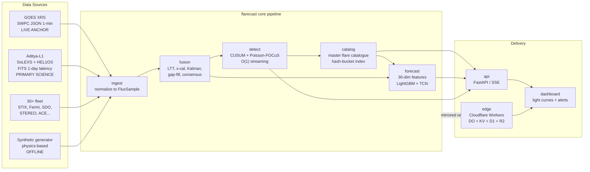
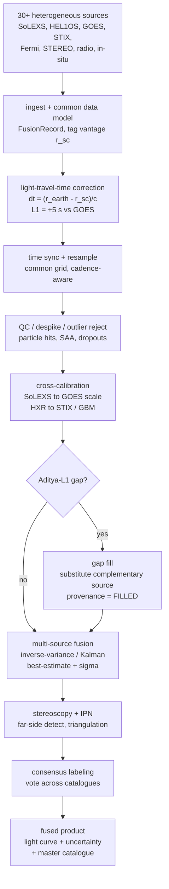
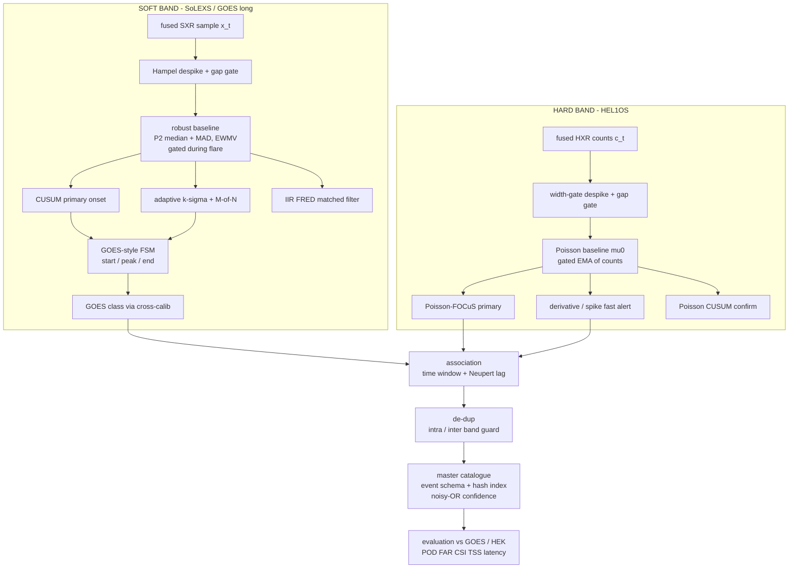
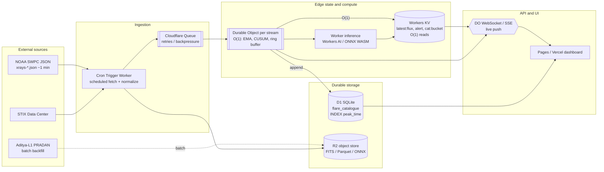

# Aditya FlareCast — System Architecture

**Product:** **Aditya FlareCast** — an automated soft + hard X-ray solar-flare **nowcasting** (real-time detection & classification) and **forecasting** (minutes-ahead probability) system built on Aditya-L1 SoLEXS + HEL1OS, anchored on live GOES XRS, fused with a 30+ satellite constellation.
**Python package:** `flarecast`
**Challenge:** ISRO Bharatiya Antariksh Hackathon (BAH) 2026 — Problem Statement 15.
**Status:** Authoritative architecture & build contract. This document is the single source of truth that the build team follows literally. Appendices A–C (repo layout, module contracts, build plan) are normative.
**Date:** 2026-06-20.

> **How to read this document.** Sections 1–11 are the design rationale and decisions, synthesizing the six research deliverables in `docs/research/`. Appendix A fixes the exact repository tree. Appendix B fixes every public class/function signature so engineers can build in parallel without collisions. Appendix C groups the files into ~6 independent workstreams. **When the prose and an appendix disagree, the appendix wins** — it is the contract.

---

## Table of contents

1. [Executive summary & problem framing](#1-executive-summary--problem-framing)
2. [End-to-end system overview](#2-end-to-end-system-overview)
3. [Multi-satellite constellation & data-fusion design](#3-multi-satellite-constellation--data-fusion-design)
4. [Nowcasting — O(1) streaming detection](#4-nowcasting--o1-streaming-detection)
5. [Forecasting — precursor model](#5-forecasting--precursor-model)
6. [Data access layer](#6-data-access-layer)
7. [Fast O(1) platform — Cloudflare edge](#7-fast-o1-platform--cloudflare-edge--offline-alternative)
8. [UI / dashboard & alerting](#8-ui--dashboard--alerting)
9. [Data model & schemas](#9-data-model--schemas)
10. [Evaluation methodology](#10-evaluation-methodology)
11. [Robustness, QC, security & limitations](#11-robustness-qc-security--limitations)
12. [Appendix A — Repository layout](#appendix-a--repository-layout)
13. [Appendix B — Module contracts](#appendix-b--module-contracts)
14. [Appendix C — Build plan](#appendix-c--build-plan)

---

## 1. Executive summary & problem framing

### 1.1 The problem, in one paragraph

Solar flares are sudden bursts of X-ray/EUV radiation from magnetic reconnection in the solar corona; the strongest drive space-weather storms that disrupt satellites, GPS, HF comms, and power grids. Aditya-L1 watches the Sun continuously from the Sun–Earth L1 point with two co-aligned, full-disk ("Sun-as-a-star", non-imaging) X-ray spectrometers: **SoLEXS** (soft X-ray, ~1–22 keV — thermal, gradual phase, the GOES-equivalent channel) and **HEL1OS** (hard X-ray, 8–150 keV — non-thermal, impulsive phase). PS-15 asks us to build an automated pipeline that **(a) nowcasts** flares by detecting them independently in soft and hard X-rays and merging into one master catalogue, and **(b) forecasts** flares by learning precursor patterns and emitting a probability with a quantifiable lead time, plus a **(c) visual interface** with light curves and alerts.

### 1.2 The single most important physical lever: the Neupert effect

The scientific basis of a *short-horizon* (minutes) flare forecast is the **Neupert effect**: the hard X-ray light curve tracks the **time-derivative** of the soft X-ray light curve, `F_HXR(t) ∝ d/dt F_SXR(t)`, equivalently `F_SXR(t) ∝ ∫ F_HXR dt` (a leaky integrator with cooling: `dF_SXR/dt = c·F_HXR − F_SXR/τ_cool`). Because the impulsive HXR rise **precedes** the SXR peak by ~1–3 minutes (with pre-flare/precursor activity earlier still), HEL1OS gives an early-warning signal for the SoLEXS/GOES-class peak. Fusing the two payloads is therefore not optional — it is the engine of the nowcast→forecast bridge. The **Neupert residual** and **corr(HXR, dSXR/dt)** are our highest-value engineered features (see §5) and the physical prior for cross-band catalogue merging (see §4).

### 1.3 Fixed strategic decisions (adopted project-wide for consistency)

| Decision | Choice | Rationale (research doc) |
|---|---|---|
| **Live operational anchor** | **GOES XRS** (NOAA SWPC JSON, ~1-min, real-time, no auth, CORS-friendly) | Aditya-L1 is ~1-day latency; GOES is the only sub-minute public X-ray feed and defines the A–X scale (`01 §3`, `05 §1.2`). |
| **Primary science + training corpus** | **Aditya-L1 SoLEXS + HEL1OS** (FITS via ISSDC PRADAN) | The subject instruments; eclipse-free, SAA-free, continuous L1 view → a *cleaner* training set than LEO (`01 §3`, `02 §J`). |
| **Constellation** | 30+ satellites for **fusion / validation / gap-fill / far-side** | Aditya alone cannot image, see far-side, or supply pre-2024 history (`02`, `06`). |
| **Two-track delivery** | (1) offline-capable Python reference impl (`flarecast`); (2) Cloudflare edge production target | Must run in a no-network sandbox *and* demonstrate the "fastest platform / O(1)" claim (`05 §2`). |
| **Detection paradigm** | **O(1) streaming** — constant work & constant state per sample | Project north star: "fastest platform, O(1) techniques" (`03`, `05 §2.7`). |
| **Forecast model** | **Two-tier**: LightGBM (production/edge) + TCN (research/challenger) | GBT wins on small tabular space-weather data and ships to the edge; TCN is the accuracy ceiling (`04 §0`). |
| **Primary forecast metric** | **TSS** (True Skill Statistic), always reported vs **persistence + climatology** baselines | TSS is class-ratio-insensitive; persistence is shockingly hard to beat (`04 §6`). |

### 1.4 Mapping to the challenge's objectives, outcomes, and evaluation criteria

| Challenge item | Where Aditya FlareCast delivers it |
|---|---|
| **Obj. 1** — automated nowcast detection + classification (soft + hard) | §4 detection stack (`detect/`), §3 fusion (`fusion/`); independent per-band detection merged into a master catalogue. |
| **Obj. 2** — predictive forecast of flares from precursors | §5 forecasting (`forecast/`); 30-dim streaming features, Neupert-central, two-tier model. |
| **Outcome A** — automated database of nowcasted flares | §4.5 master catalogue (`catalog/`), §9 schemas (JSON + SQL DDL). |
| **Outcome B** — trained model with quantifiable lead time | §5.4 lead-time quantification; LT distribution + LT-vs-FAR curve. |
| **Outcome C** — interface visualizing light curves + visual alerts | §8 dashboard (`dashboard/`), §7 live push (SSE/WebSocket). |
| **Eval — detect low- AND high-class flares** | §4: dual-detector SoLEXS arbitration (SDD1 small flares ↔ SDD2 saturating M/X); Poisson-FOCuS catches faint HXR; per-class POD in §10. |
| **Eval — high TPR / low FAR** | §10 TSS/POD/FAR; §3 two-sensor-agreement gating as a false-alarm killer; §4 M-of-N persistence + hysteresis. |
| **Eval — lead time (minutes before peak)** | §5.4 strict pre-peak labeling, median LT + fraction with LT ≥ {5,10,15,30} min, per class. |

### 1.5 What "good" looks like (honest targets)

- **Nowcast:** match the SWPC/HEK GOES flare list with high POD and low FAR on a held-out period; correctly classify A–X with ≤ ±1 sub-class error on the majority of M/X; detect HXR-only (non-thermal-dominated) events GOES misses.
- **Forecast:** beat persistence and climatology on **TSS, HSS, BSS** at N ∈ {15, 30, 60} min for ≥C and ≥M; report a calibrated probability (reliability diagram + ECE) and a positive median lead time.
- **Platform:** O(1) hot path (latest flux, latest alert, catalogue-by-time, per-sample detection) demonstrably constant-time; identical detector math in edge (Cloudflare) and offline (Python) stacks.

---

## 2. End-to-end system overview

Aditya FlareCast is a **single logical pipeline** — `ingest → fusion → nowcast detection → master catalogue → forecast → API → UI/alerts` — with **two physical substrates**: the offline-capable Python reference (`flarecast`) and the Cloudflare edge deployment (`edge/`). The detector math is byte-for-byte the same logic on both substrates, so the offline demo is a faithful preview of production.



**Stage responsibilities (one line each):**

| Stage | Package | Responsibility |
|---|---|---|
| Ingest | `flarecast.ingest` + `flarecast.synth` | Pull real sources (GOES JSON live; FITS/Fido archive) or generate physics-based synthetic streams offline; normalize every sample to one `FluxSample`. |
| Fusion | `flarecast.fusion` | LTT-correct to Earth frame, time-align, cross-calibrate to GOES/STIX scales, gap-fill from complementary sensors, Kalman/inverse-variance fuse → one best-estimate light curve + σ; build consensus labels. |
| Detect | `flarecast.detect` | O(1) streaming onset/peak/end per band (CUSUM soft, Poisson-FOCuS hard), GOES classification, despiking, gating. |
| Catalogue | `flarecast.catalog` | Associate soft+hard into master events (Neupert-aware), de-dup, store with hash-bucket O(1) index, confidence fusion. |
| Forecast | `flarecast.forecast` | 30-dim streaming features, LightGBM + TCN, calibrated P(flare in next N), lead time, leakage-free CV, metrics. |
| API | `flarecast.api` | FastAPI: O(1) reads (latest/alert/catalogue-by-time), SSE live push, forecast endpoint. |
| UI | `dashboard/` | Static dashboard: soft+hard light curves, flare markers, probability gauge, alert banner, catalogue table. |
| Edge | `edge/` | Cloudflare Cron + Durable Object + KV + D1 + R2 + Workers AI — the O(1) production target. |

**The latency split (critical architectural fact):** the *live operational* clock runs on **GOES XRS arrival time**; **Aditya-L1 arrives ~1 day later** and is fused in for post-hoc relabeling, training, and validation. The fusion layer's `latency_budget` per source enforces that slower-arriving sources are never used as real-time nowcast features (no look-ahead leakage), only for labels/training (`06 §2.4`).

---

## 3. Multi-satellite constellation & data-fusion design

> Governing research: `02-satellite-fleet-30plus.md` (census) and `06-data-fusion-gapfilling.md` (fusion math). Implemented by `flarecast.fusion`.

### 3.1 Why Aditya alone is not enough

SoLEXS/HEL1OS are excellent disk-integrated X-ray instruments but: do **not image** (no flare location/AR attribution), are **blind to the far side** (~half the Sun), have **no public data before ~July 2024** (no historical training set), and suffer occasional station-keeping/telemetry gaps with ~1-day latency. The constellation closes each gap.

### 3.2 The fleet (30+), organized by physical quantity

Fusion only ever combines sources that estimate the **same** physical quantity (after cross-calibration). Different quantities are *features*, not redundant measurements.

| Physical quantity | Aditya primary | Cross-check / gap-fill (representative) | Role |
|---|---|---|---|
| **Soft X-ray flux** (1–8 Å, W m⁻²) | **SoLEXS** | GOES-16/18/19 XRS, Chandrayaan-2 XSM, MinXSS/DAXSS, GOES-R EXIS, PROBA-2/LYRA | label anchor + fill |
| **Hard X-ray** (counts/photons) | **HEL1OS** | Solar Orbiter STIX, Fermi GBM, Konus-Wind, INTEGRAL SPI-ACS, ASO-S/HXI, NuSTAR, RHESSI (hist.) | validate + IPN timing |
| **EUV imaging/irradiance** | (SUIT NUV) | SDO/AIA+EVE, GOES SUVI, STEREO-A/EUVI, Solar Orbiter/EUI, PROBA-2/SWAP | localization + far-side |
| **Magnetograms** (precursor) | — | SDO/HMI (SHARP), GONG (incl. Udaipur), ASO-S/FMG, Hinode/SP, SOHO/MDI (hist.) | forecast precursor |
| **Radio (Type II/III)** | — | Wind/WAVES, STEREO/SWAVES, PSP/FIELDS, Solar Orbiter/RPW, e-CALLISTO, Nobeyama/RSTN | earliest trigger |
| **In-situ particles (SEP)** | ASPEX/PAPA | ACE, GOES/SEISS, SOHO/ERNE, Wind/3DP, STEREO/IMPACT, PSP/ISʘIS | SEP context + despike |

The census enumerates 50+ distinct platforms (`02`), comfortably exceeding the 30+ mandate. The architecture is **source-agnostic**: a registry table (`fusion.registry`) lets new platforms be added with no code changes.

### 3.3 Recommended core set to integrate FIRST (the 80/20)

Integrating 50 streams at once is infeasible. The **core 10** give ~90% of the value with well-documented, openly accessible APIs (ordered by priority): **(1) GOES XRS** (label anchor, live JSON), **(2) Aditya-L1 SoLEXS+HEL1OS** (subject), **(3) SDO/AIA+HMI** (localization + SHARP precursor), **(4) Solar Orbiter/STIX** (imaged HXR + far-side), **(5) Fermi GBM** (whole-sky HXR sub-second timing), **(6) STEREO-A** (far-side EUV+SEP+radio in one bus), **(7) GOES SUVI+SEISS** (EUV co-located with XRS + SEP labels), **(8) GONG** (24/7 magnetograms), **(9) ACE** (L1 in-situ), **(10) Wind/WAVES + e-CALLISTO** (Type-III earliest trigger). Stretch: **DAXSS** (best SXR spectral cross-cal, India-linked) and **ASO-S** (independent HXR imaging + vector magnetograms).

### 3.4 The fusion pipeline



### 3.5 Light-travel-time (LTT) correction — mandatory before fusion

A UTC timestamp on two spacecraft does **not** mean they saw the same photons: they sit at different distances from the Sun. The **fusion key is `t_earth_utc`**, the time the photons would have reached a common 1-AU (Earth/L1) reference:

```
Δt_(k→⊕) = (r_⊕ − r_k) / c ,   t_earth_utc = t_obs_utc + Δt_(k→⊕)
c = 299792.458 km/s ,  1 AU = 1.495978707e8 km
```

| Spacecraft | Heliocentric r | Δt to Earth frame | Meaning |
|---|---|---|---|
| **Aditya-L1** | 0.990 AU (1 AU − 1.5e6 km) | **+5.0 s** | L1 sees flares ~5 s **before** GOES |
| Earth / GOES (reference) | 1.000 AU | 0 | reference frame |
| Solar Orbiter (~0.5 AU) | 0.50 AU | ~+249 s | matches published STIX `EAR_TDEL` ≈ +239.9 s |
| STEREO-A (~0.96 AU) | 0.96 AU | +20 s | small SXR offset, large azimuthal offset |
| Parker (perihelion) | ~0.046 AU | +476 s | ~8 min earlier — strongest precursor lead |

The correction is **time-dependent** for eccentric orbits (Solar Orbiter, Parker, STEREO) — never hard-code a constant for them; `r_k(t)` comes from SPICE/mission ephemerides (or STIX `EAR_TDEL`). **In-situ particles keep their own clock** (transport delay ≪ c along the Parker spiral) — we never fuse proton timing with photon timing.

### 3.6 Time alignment across cadences

Streams arrive at 1 s (SoLEXS, HEL1OS, GOES-1s), 1 min (irradiance), 12 min (HMI), and asynchronous (radio bursts, triggers). The master nowcast grid is **uniform Δ = 1 s in `t_earth_utc`**; forecast/feature grids are coarser **aggregates** (1 min, 5 min) built by aggregation, never interpolation. **Direction matters** (this is where spurious correlations are born): downsample with block mean (flux) / sum (counts) / max (peaks); upsample snapshots (HMI) with **forward-fill (ZOH) + `INTERPOLATED` flag + age column**; interpolate numeric gaps **only up to 3×cadence** and **in log-domain for SXR**; never spline impulsive HXR (overshoot → false precursors). Four guards against spurious correlation: track provenance for shared-filler correlation; identical resampling policy per quantity-class; restrict cross-correlation to `GOOD` native-cadence samples; enforce `latency_budget` so slower sources never leak future info into a nowcast.

### 3.7 Cross-calibration (so everyone is on a common scale)

**SoLEXS → GOES scale** (two-step, `06 §3.1`): **(A)** synthesize the GOES 1–8 Å band from the calibrated SoLEXS photon spectrum `Ŝ = ∫ S(E)·E·R_GOES(E) dE`; **(B)** fit a robust (Huber/Theil–Sen/ODR) log-space transfer `log F_GOES = a + b·log Ŝ + ε` on the overlap set of jointly observed flares. Published cross-cal anchors `a≈0, b≈1` (SoLEXS vs GOES-XRS and Chandrayaan-2/XSM agree within ~10–15%). Fit **per detector** (SDD1 vs SDD2) and enforce continuity at the hand-over flux. **HXR (HEL1OS ↔ STIX ↔ GBM):** pick a reference band (25–50 keV), invert each instrument to common photon flux (removes area/response differences), fit pairwise gain/offset on LTT-aligned joint flares, chain to STIX as reference (GBM as all-sky high-cadence anchor). The **post-cal uncertainty** (statistical ⊕ transfer-residual) becomes each source's `sigma` — which is exactly what the fusion stage consumes as weights.

### 3.8 Fusion estimators: inverse-variance + Kalman

**Static inverse-variance (baseline, per grid cell):** for N cross-calibrated measurements `x_i` with variances `σ_i²`, the minimum-variance unbiased estimator is `x̂ = Σ w_i x_i / Σ w_i`, `w_i = r_i/σ_i²` (reliability-weighted), with `σ_x̂² = 1/Σ w_i` — **smaller than any single input** (two equal sensors → σ²/2). Correlated sources use the GLS form with the full covariance `R` to avoid double-counting.

**Kalman filter (production, temporal):** track state `s = [log₁₀F, d log₁₀F/dt]` (captures exponential rise/decay); predict with a constant-rate model + process noise `Q`; **update once per available sensor** in each step (sequential update is algebraically identical to batch inverse-variance for independent sensors). Two payoffs fall out for free: **(1)** the **χ²₁,₀.₉₉₉ ≈ 10.8 innovation gate** rejects outliers automatically (a particle spike on one sensor is gated while others update) — *automatic FAR reduction*; **(2)** when no sensor is valid, the predict step coasts and `P` grows → the uncertainty band visibly widens during a gap and shrinks when data returns — *automatic gap handling*.

### 3.9 Consensus labeling (voting across catalogues)

Single catalogues disagree (GOES vs RHESSI: 25,691 vs 121,430 events over 2002–2017). Labels are built by **voting**: LTT-correct all catalogue times to `t_earth_utc`, associate by temporal overlap (±3 min peak) + location (±10°), then `conf(e) = Σ ρ_j v_j / Σ ρ_j` with reliability `ρ_j`; `confirmed` if conf ≥ 0.7, `candidate` if ≥ 0.3, else `rejected`. Conflict rules: HXR-present/SXR-absent → keep as confirmed HXR event, flag `sxr_weak` (valuable forecast signal); single-catalogue → candidate, promoted only if our own fused detection or IPN/stereoscopy corroborates. Confidence is stored on every label and propagated into training (sample weighting).

### 3.10 Far-side coverage & IPN triangulation

**Far-side:** STEREO-A and Solar Orbiter (EUI/STIX) catch flares occulted from L1; a far-side active region flaring is a multi-day precursor for when it rotates to face Earth. **IPN triangulation** locates impulsive HXR bursts from non-imaging detectors purely by arrival-time differences: for baseline `D₁₂`, `cos θ = c·δt / D₁₂` confines the source to an annulus of half-width `δθ ≈ c·σ_δt/(D₁₂ sin θ)`; three+ spacecraft → intersecting annuli → an error box. `δt` is cross-correlated from **raw sub-second event times** (kept in a side table, not the gridded series). IPN is also a **powerful false-alarm killer**: a real solar transient triangulates consistently across separated spacecraft; a local particle hit does not.

### 3.11 QC & provenance

QC is per-sample, per-source, stored as a **bitmask** so conditions coexist (`FILLED|near_SAA`): `GOOD` (full weight) → `INTERPOLATED` (inflated σ) → `FILLED` (filler σ ⊕ transfer residual, provenance recorded) → `SUSPECT` (gated but logged) → `BAD` (excluded). Particle-hit despiking is multi-stage: housekeeping gating (SAA/eclipse/off-point) → iterative bidirectional median sigma-clip (5–11σ) → X-ray spectral-shape test (non-solar signature → reject) → cross-sensor veto (the strongest test, via the Kalman innovation gate + IPN) → in-situ proton cross-reference. Every fused sample is fully reconstructible from contributing `source_id`s + weights + cal versions + QC bitmask + `ingest_hash`.

---

## 4. Nowcasting — O(1) streaming detection

> Governing research: `03-detection-algorithms.md`. Implemented by `flarecast.detect` and `flarecast.catalog`.

### 4.1 The streaming contract

Every detector primitive must honour: **(1)** `update(x_t)` runs in **O(1) time**; **(2)** state size is **O(1)** (independent of samples seen); **(3)** no re-reading past raw samples (raw history, if any, lives only in a fixed-size ring buffer). A "window" is *implicit* (an EMA's exponential memory), never an array we recompute. This is the heart of the O(1) mandate.

### 4.2 The detection stack



### 4.3 O(1) primitives (the reusable building blocks)

| Primitive | Module | Time | State | Role |
|---|---|---|---|---|
| **EMA** (recursive low-pass) | `detect.primitives.EMA` | O(1) | 1 float | baseline / trend; `μ_t = α μ_{t-1} + (1-α) x_t` |
| **EWMV** (EW mean+variance) | `detect.primitives.EWMV` | O(1) | 2 floats | drift-aware variance (preferred over Welford) |
| **Welford** (online variance) | `detect.primitives.Welford` | O(1) | 3 floats | unweighted, numerically stable |
| **Ring buffer** (len L) | `detect.primitives.RingBuffer` | O(1) | L floats | fixed-memory raw history |
| **P² quantile** (median/MAD) | `detect.primitives.P2Quantile` | O(1) | 5 floats/quantile | robust baseline + scale |
| **Hampel** (median/MAD test) | `detect.primitives.HampelDespiker` | O(1) | O(1) | robust outlier flag + despiker |
| **EMA-derivative / SG slope** | `detect.primitives.SlopeEstimator` | O(1) | O(window) const | onset & Neupert bridge |

> **Critical subtlety:** the baseline/variance estimators must be **frozen (gated)** while a flare is in progress, else the flare contaminates the baseline and the detector "adapts away" the very signal it should catch. The robust median baseline further resists residual contamination.

### 4.4 Per-band detectors

**Soft band (SoLEXS / GOES long) — primary = CUSUM.** One-sided upper CUSUM detects flux increases: `S_t = max(0, S_{t-1} + (x_t − b_t) − k_c·σ_t)`, alarm when `S_t > h_c·σ_t`, reset on alarm; the last reset-to-0 before the alarm is the MLE **onset time** (free, principled flare-start for the catalogue). O(1), one float, **analytic FAR** via ARL curves. Framed by the **GOES-style finite-state machine** (NOAA operational rule, directly portable to SoLEXS): start = first of 4 consecutive minutes of monotonic increase with minute-4 flux ≥ 1.4× minute-1; peak = max; end = decay to `(x_peak + x_start)/2`. Cross-checked by **adaptive k·σ + M-of-N persistence** and confirmed by an **IIR (SPIIR) FRED matched filter** (sum of a few EMAs approximating fast-rise/exponential-decay — O(1) shape confirmer).

**Hard band (HEL1OS) — primary = Poisson-FOCuS.** HXR data are low-count Poisson; Gaussian thresholds are invalid. **Poisson-FOCuS** (Functional Online CUSUM, developed for onboard GRB/CubeSat triggers — a direct analogue of HEL1OS flare onset) tests **all post-change magnitudes and all window sizes simultaneously** at amortised **~O(1)** via a pruned piecewise-quadratic "curve list" — no need to pre-guess the flare magnitude (flares span orders of magnitude), correct Poisson statistics at low counts, multi-timescale. Backed by a **derivative/spike detector** (earliest impulsive alert) and a **Poisson CUSUM** confirm. Width-gated despiking removes cosmic rays (a one-bin excursion is a cosmic ray; a sustained one ≥ `w_min` bins is a flare).

### 4.5 GOES A–X classification

Class = order of magnitude of peak 1–8 Å flux (W m⁻²): A < 1e-7, B [1e-7,1e-6), C [1e-6,1e-5), M [1e-5,1e-4), X ≥ 1e-4; sub-class is the linear mantissa (M2.5 = 2.5e-5). Closed-form `classify(F)` is pure arithmetic → **O(1)** (`detect.classify.classify_flux`). Deriving GOES class **from SoLEXS** is a *derived product*: emit **two numbers** — the instrument-native peak (always valid) and the GOES-equivalent class via the calibrated conversion (band-fold or isothermal (T,EM) synthesis, with the cross-cal correction from §3.7), tagged with uncertainty. **Detector arbitration** selects the unsaturated SoLEXS SDD before computing peak flux: SDD1 (large aperture) for quiet/small flares; switch to **SDD2** (small aperture) above ~1e5 cps where SDD1 saturates (SDD2 captured the X8.7 of May 2024). Never read SDD1 paralyzable turnover as a real flux dip; if both saturate, report a lower-bound class (`≥Xn`).

### 4.6 Master-catalogue merge (Neupert-aware)

Detect independently per band, then **associate** into single physical events using the Neupert prior: expect **HXR onset ≤ SXR onset** and **HXR peak < SXR peak** (lead seconds–minutes). `MATCH_SCORE` combines temporal overlap (asymmetric window — `W_lead ≈ 5 min` on the hard-before-soft side, `W_lag ≈ 10–15 min` for long soft decay), peak-lag consistency (reward `t_peak^HXR < t_peak^SXR`), and optional lagged correlation of `d/dt[SXR]` vs `HXR`. De-dup intra-band (sub-peaks of one complex flare are not separate events unless separated by a clean return-to-baseline + guard `Δ_dedup`) and inter-band (one master event carries both flags). Confidence via **noisy-OR** over firing detectors: `confidence = 1 − Π_d (1 − p_d)`, with cross-band agreement + Neupert consistency as bonus weight.

### 4.7 O(1) catalogue index

Index events by **time bucket** so "what flares near time T?" is O(1): `bucket(t) = floor(epoch_s / B)` (e.g. B = 3600 s), `HashMap<bucket_id, list<event_id>>`. Insert O(1); point query O(1); range query O(#buckets spanned). Association only scans current + previous bucket → O(1) per detection. Secondary hash indices (`class → events`) for richer queries.

### 4.8 O(1) complexity justification table

| Operation | Complexity | Mechanism |
|---|---|---|
| EMA / EWMV / Welford baseline update | **O(1)** | constant-time arithmetic on constant-size state |
| P² median + MAD update | **O(1)** | 5 markers per quantile, parabolic interpolation |
| Hampel despike | **O(1)** | running median/MAD comparison |
| CUSUM update (soft onset) | **O(1)** | one float, one max + add |
| Poisson-FOCuS update (hard onset) | **~O(1) amortised** | pruned piecewise-quadratic curve list (handful of curves) |
| IIR matched filter | **O(1)** | sum of P≈2–4 one-pole EMAs |
| GOES classification | **O(1)** | closed-form log10 + lookup |
| Ring-buffer push / last-L access | **O(1)** | circular array, fixed L |
| Catalogue insert | **O(1)** | append to hash bucket |
| Catalogue point/by-time query | **O(1)** | hash the time → bucket |
| Cross-band association (per detection) | **O(1)** | scan current + previous bucket only |
| Confidence fusion (noisy-OR) | **O(#detectors)** = O(1) | fixed small detector set |

The only super-constant pieces (FIR matched filter O(L), full BOCPD O(R_max)) are deliberately replaced by O(1) approximations or kept off the hot path (BOCPD optional, default OFF, only as a downsampled confidence scorer). **Everything on the hot path is O(1) time, O(1) state.**

---

## 5. Forecasting — precursor model

> Governing research: `04-forecasting-models.md`. Implemented by `flarecast.forecast`.

### 5.1 Two-tier design

- **Tier 1 — PRODUCTION (edge):** **LightGBM** on a ~30-dim streaming feature vector, framed as binary "flare ≥ class C within next N minutes?", with **N as an explicit input feature** (or a small per-N bank for N ∈ {15, 30, 60} min). Inference = a few hundred shallow tree traversals → microseconds; exportable to ONNX; runs on Cloudflare Workers AI. **Isotonic/Platt calibration** bolted on so the output is a trustworthy probability.
- **Tier 2 — RESEARCH (challenger):** a small **TCN** (dilated causal 1-D convs, strictly causal → no leakage) on the raw multichannel windowed light curve, predicting a multi-horizon probability curve `P(flare within h)` for h ∈ {5,…,120} min. ONNX-exportable; captures shapes the hand features miss (QPP pre-flare pulsations, subtle Neupert build-up). A GRU is the stateful alternative (literal O(1)/step).

**Deploy GBT; keep TCN as challenger + offline re-scorer + ensemble member.** This is the proven "fast edge inference + heavy offline model" pattern.

### 5.2 The 30-dim streaming feature vector (Neupert-central)

All features are causal and incrementally maintainable (EMAs/Welford/ring-buffer → O(1)). Work in log-flux for level features (X-ray flux is log-distributed). Two raw channels: `S` (SoLEXS soft) and `H` (HEL1OS hard).

| # | Feature | Group | Notes |
|---|---|---|---|
| 1–4 | `logS`, `logH`, `S_over_baseline`, `H_over_baseline` | Levels/baselines | EMA-smoothed; quiet-Sun normalized |
| 5–9 | `sxr_slope_short`, `sxr_slope_long`, `sxr_curvature`, `hxr_slope_short`, `slope_accel` | Slopes/derivatives | the precursor signal; `slope_accel = short − long` |
| 10–12 | `ema_ratio_S`, `ema_ratio_H`, `ema_ratio_cross` | EMA ratios | multi-scale trend; >1 ⇒ rising |
| 13–16 | `hardness_ratio`, `d_hardness`, `temp_proxy`, `d_temp_proxy` | Hardness/spectral | hardening = non-thermal onset |
| **17–19** | **`neupert_corr`, `neupert_resid`, `hxr_leads_flag`** | **Neupert (highest value)** | `corr(H, dS/dt)`; `‖H − α·dS/dt‖`; leading-indicator boolean |
| 20–23 | `sxr_var`, `hxr_var`, `hxr_burst_count`, `hxr_peak_over_baseline` | Variance/bursts | microflare precursors |
| 24–27 | `time_since_last_flare`, `flares_last_6h`, `decayed_flare_history`, `time_since_last_microflare` | History (Hawkes-flavored) | `decayed = Σ exp(−Δt/τ)`, τ≈6 h |
| 28–30 | `quiet_duration`, `solar_cycle_phase`, `N_horizon` | Context/state | `N_horizon` = forecast horizon as a feature |

For the TCN, the raw input is a `[L, C]` tensor (L≈120 steps × 1 min look-back; C≈4–8 channels: logS, logH, hardness, dlogS/dt, dlogH/dt, + optional sub-bands).

### 5.3 Problem formulation & labels

**Primary framing (a):** binary sliding-window classification — at step t, using only data ≤ t, predict y=1 if a flare peak of class ≥ threshold occurs in (t, t+N]. **Default threshold ≥ C** (Sun-as-a-star sees many C → learns precursors and gets statistics), plus a **≥ M** operational variant. **Deliverable framing (b):** multi-horizon probability curve `P(flare within h)`. **Unifier (c):** discrete-time hazard — `P(flare within N) = 1 − Π(1 − hazard_k)` — makes "P in next N" and "lead time" the same model and handles right-censoring correctly.

**Labels:** ground truth = flare **peaks** from our own SoLEXS/HEL1OS master catalogue (same instrument as inputs), **cross-checked against GOES/HEK** (via SunPy Fido → HEK and the GOES XRS event list). Use the peak (not onset) as the reference because lead-time is defined relative to peak. **Strict pre-peak positives** (`t < p`) so a "forecast" can never fire at/after peak. **Mask in-flare/decay samples** from the negative class (label "in-event", exclude) so they don't confuse the precursor signal.

### 5.4 Leakage-free CV and lead-time quantification

**CV — temporal blocks only.** Never random-shuffle (adjacent windows overlap → one flare's pre-window leaks across splits). Use blocked rolling-origin / walk-forward with **embargo/purge gaps ≥ N + max window** between train and test; **group all windows of one flare into the same fold**; keep a final untouched most-recent hold-out for headline numbers.

**Lead time:** for each true flare with peak `p`, `LT = p − t_alert` where `t_alert` is the first probability crossing of threshold θ in `[p−W, p)` (require k-of-m consecutive crossings to suppress flicker); if never crossed before p → missed forecast (counts against TPR). **Report:** LT distribution (median = headline, IQR, fraction with LT ≥ {5,10,15,30} min); **LT-vs-FAR trade-off curve** (sweep θ) — *the* operating-point plot that addresses all three evaluation axes (TPR, FAR, lead time) at once; per-class LT (≥C and ≥M). Honesty check: verify LT > 0 (alerts before peak).

### 5.5 Metrics & baselines

Flares are rare → accuracy/ROC-AUC mislead. Battery: **TSS (primary)**, HSS, **BSS** (probabilistic, vs climatology, decomposes into reliability+resolution−uncertainty), PR-AUC (> ROC under imbalance), reliability diagram + ECE, POD/FAR, confusion matrix at chosen θ. **Mandatory baselines to beat: climatology** (constant base-rate P), **persistence** ("flaring now ⇒ predict flare", + decayed variant — the 2025 SWPC verification shows persistence is shockingly hard to beat at 24 h), and a **Hawkes/Poisson event-rate** model. Class-imbalance: prefer **loss-based** (focal loss, `scale_pos_weight`) over oversampling (avoids temporal leakage); calibrate then choose θ by TSS-max or FAR-budget; early-stop on TSS or PR-AUC, never accuracy. Context benchmark: Landa & Reuveni (2022) reached TSS ≈ 0.74 forecasting ≥M from GOES X-rays alone — the closest analog; adding HEL1OS HXR + Neupert features should help short lead times.

### 5.6 Edge inference

Training (GBT boosting, TCN backprop, hyper-search, calibration) is offline/batch. Inference is the light streaming path: GBT = sum over shallow trees (µs, tiny memory), feature computation O(1) via running EMAs + Welford + ring-buffer; small TCN O(window), ONNX-exportable; GRU literal O(1)/step. Re-train per Carrington rotation / monthly offline, ship updated tree tables / ONNX to the edge.

---

## 6. Data access layer

> Governing research: `05-data-access-and-platform.md` Part 1 and `02 §I`. Implemented by `flarecast.ingest`.

**Two access tiers (conflating them is the #1 mistake):** **(1) real-time/nowcast** — small JSON polled directly (GOES SWPC) for the live hot path; **(2) archive/science/training** — big FITS/NetCDF/CDF via SunPy Fido, cdasws, drms, stixdcpy. Unifying glue is **SunPy `Fido`** (federated VSO/JSOC/HEK/CDAWeb/XRS/RHESSI/GONG/e-CALLISTO) + astropy for FITS; go direct where Fido has no client (PRADAN, STIX, raw SWPC JSON).

| Source | Library / API | Endpoint (verification status) | Cadence | Auth | Offline fallback |
|---|---|---|---|---|---|
| **GOES XRS real-time** | stdlib `urllib`/`requests` | `services.swpc.noaa.gov/json/goes/primary/xrays-*.json` **(verified)** | ~1 min | none | bundled cached JSON in `examples/data/` → `synth` generator |
| **GOES flare events** | `requests` | `.../json/goes/primary/xray-flares-{latest,7-day}.json` **(verified)** | event | none | cached JSON sample |
| **GOES XRS L2 science** | `xarray`/`netCDF4`, astropy | `data.ngdc.noaa.gov/.../goes16/l2/data/xrsf-l2-*` **(verified)** | 1 s / 1 min | none | cached NetCDF sample (optional) |
| **GOES XRS (federated)** | SunPy `Fido` + `sunkit-instruments` | `a.Instrument.xrs` | 1 s / 1 min | none | Fido cache; else synth |
| **SunPy Fido (general)** | `sunpy.net.Fido` | VSO/JSOC/HEK/CDAWeb | varies | some | local FITS in `examples/` |
| **SDO AIA / HMI (SHARP)** | `drms`; Fido (JSOC/VSO) | `jsoc.stanford.edu` DRMS | 12 s / 720 s | email reg (export) | optional; precursor feature only |
| **CDAWeb (ACE/DSCOVR/Wind)** | `cdasws`; Fido | `cdaweb.gsfc.nasa.gov/WS/cdasr/` **(verify)** | 1–60 s | none | cached CDF sample (optional) |
| **Solar Orbiter STIX** | `stixdcpy` | `datacenter.stix.i4ds.net` **(verified)** | QL ~min | none | cached sample / synth HXR |
| **Fermi GBM (daily)** | astropy; HEASARC | `heasarc.gsfc.nasa.gov/.../fermigdays` **(verified)** | continuous | none | cached sample (optional) |
| **RHESSI (historical)** | Fido; HTTPS bulk | `hesperia.gsfc.nasa.gov/hessidata/` **(verified)** | 2002–2018 | none | optional |
| **HEK (flare catalogue)** | Fido `a.hek.*` | LMSAL HEK service | event | none | **bundled HEK label sample** for offline eval |
| **Aditya-L1 SoLEXS/HEL1OS** | `requests` session + astropy FITS | `pradan.issdc.gov.in/al1/` **(verified)** | L1/L2 batch | **login** | **synth FITS-like light curves** + cached sample |
| **e-CALLISTO (radio)** | astropy FITS | `e-callisto.org/Data/data.html` **(verified)** | event | none | optional |
| **GONG (magnetograms)** | Fido `GONGClient` | `gong2.nso.edu` / NSO NISP **(verify)** | ~1 min | none | optional |
| **NOAA SRS / F10.7** | Fido (`SRS`, `NOAAIndices`) | SWPC/NGDC | daily | none | cached index sample |

**Offline fallback strategy (non-negotiable for the sandbox).** Every fetcher implements the same `Fetcher` protocol (Appendix B) and follows the order: **(1)** try network source → **(2)** on any `URLError`/`OSError`/timeout, fall back to a **cached sample** bundled in `examples/data/` → **(3)** if no cache, fall back to the **physics-based synthetic generator** (`flarecast.synth`). The synthetic generator is the keystone of offline capability: it produces SoLEXS-like (FRED soft profile) and HEL1OS-like (impulsive spiky, Neupert-consistent) light curves plus a ground-truth event list, so the *entire* pipeline — detection, fusion, forecasting, dashboard — runs and is testable with **zero network and zero credentials**. The same `flarecast` API connects to real sources when network is available.

---

## 7. Fast O(1) platform — Cloudflare edge + offline alternative

> Governing research: `05-data-access-and-platform.md` Part 2. Implemented by `edge/` (production) and `flarecast.api` + `dashboard/` (offline).

### 7.1 Cloudflare-first edge architecture

| Layer | Component | Why |
|---|---|---|
| **Ingestion** | Workers **Cron Triggers** (`scheduled()`), optional **Queues** | Cron pulls SWPC JSON + STIX each cadence; Queues decouple fetch from processing (retries/backpressure). |
| **Hot state (O(1))** | **Workers KV** + **Durable Objects** | KV: globally-replicated key→value, sub-10 ms reads, for `latest:flux`, `alert:*`, `cat:bucket:<t>`. DO: single-instance, in-memory, strongly consistent **per-stream online detector state**. |
| **Catalogue (queryable)** | **D1** (serverless SQLite) | Relational flare catalogue + `peak_time` index for range/backtest queries (the analytics path). |
| **Bulk / raw** | **R2** (S3-compatible, no egress fees) | Raw FITS, Parquet light curves, ONNX model artifacts. |
| **Inference** | **Workers AI** or **ONNX-in-Worker** (WASM `onnxruntime-web`) | Edge forecast at ingest time, fed the DO ring buffer (constant-size input). |
| **API + live push** | **DO WebSocket (Hibernatable) / SSE** | DO fans out live updates cheaply (sleeps while holding the socket). |
| **UI** | **Cloudflare Pages** (or **Vercel** edge) | Light-curve chart + alert banner subscribing to the live stream. |



### 7.2 Why two stores (KV *and* D1)?

They are **not** redundant. KV is the **O(1) hot cache** (one key → one value, no scan). D1 is the **queryable system of record** (range/aggregate over the catalogue). The writer updates **both**: KV for instant lookups, D1 for analytics/backtests.

### 7.3 Explicit O(1) justification + honest caveats

| Operation | Complexity | Mechanism |
|---|---|---|
| Read latest flux / latest alert | **O(1)** | single KV GET (hash lookup, no scan) |
| Read catalogue at time *t* | **O(1)** | key `cat:<stream>:<hour-bucket>` → one get; time bucketing makes "by time" a direct key |
| Detector update per sample | **O(1)** | EMA/CUSUM/background/ring-buffer = constant-time arithmetic on constant-size DO memory |
| Live fan-out per client message | **O(1)** | DO holds the socket; broadcast is O(#subscribers), each send O(1) |
| Per-stream isolation/routing | **O(1)** | `idFromName(stream)` deterministically maps to one DO; no global lock/scan |

**What is deliberately NOT O(1) (and shouldn't be forced to be):** historical **range/aggregate** queries over the catalogue are **O(log n + k)** via the D1 `peak_time` index — the right tool for backtests. Claiming O(1) for arbitrary range scans would be false; we split the hot path (O(1)) from the analytics path (indexed). **Honest caveat:** KV writes are eventually consistent (~60 s global propagation); the live alert uses the **immediate DO broadcast**, KV is the durable O(1) cache for *other* edge reads; where read-your-write matters, read from the DO (strongly consistent).

### 7.4 Offline FastAPI + SQLite + static-dashboard alternative

For the sandbox (no network/creds) and for judges to run locally, the **same EMA/CUSUM/Poisson-FOCuS detector math** runs in Python with: ingest = the offline-fallback fetchers (§6); store = stdlib **SQLite** (same `flare_catalogue` schema) or DuckDB; API = **FastAPI** with an `/sse` `text/event-stream` endpoint; UI = a **static HTML/JS dashboard** (Plotly) consuming SSE. **The crucial property: the detector math is identical in the edge (Durable Object) and offline (Python) stacks**, so the local demo is a faithful preview of production — only the substrate (KV/DO/D1 ↔ dict/SQLite) differs.

---

## 8. UI / dashboard & alerting

> Implemented by `dashboard/` (static), served by `flarecast.api` offline or Cloudflare Pages in production.

A single-page dashboard, framework-free (vanilla HTML/CSS/JS + Plotly via CDN with a vendored fallback) so it runs offline:

- **Dual live light curves** — soft (SoLEXS/GOES long, log W m⁻² with A–X class bands shaded) and hard (HEL1OS counts, multi-band) on a shared time axis; fused best-estimate overlaid with its ±1σ band.
- **Flare markers** — vertical markers at nowcasted start/peak/end; HXR spikes annotated; Neupert overlay (`d/dt SXR` vs HXR) toggle.
- **Nowcast/forecast probability gauge** — current `P(flare in next N)` with N selector {15,30,60} min; calibrated probability; color by ≥C / ≥M.
- **Alert banner** — fires on nowcast onset or forecast threshold crossing; shows class, confidence, lead time; severity color.
- **Catalogue table** — recent master-catalogue events (time, class, soft/hard flags, Neupert-consistent, confidence, ref-match), sortable, backed by the O(1) by-time / D1 range query.
- **Live transport** — SSE (offline `/sse`) or WebSocket (edge DO); auto-reconnect; shows data-quality `Q(t)` confidence bar from fusion.

---

## 9. Data model & schemas

> Governing research: `06 §1` (FusionRecord), `03 §4.4` (event record), `04` (forecast record). Implemented by `flarecast.fusion.schema`, `flarecast.catalog.schema`, `flarecast.forecast`.

### 9.1 `FluxSample` — the canonical ingest record (one sample of one stream)

```python
@dataclass
class FluxSample:
    stream: str          # "goes-primary-long" | "solexs-sxr" | "hel1os-hxr-8-30keV" | ...
    t: float             # epoch seconds UTC (observed)
    value: float         # canonical unit for the quantity
    unit: str            # "W m^-2" | "counts/s"
    source: str          # "SWPC" | "AdityaL1-SoLEXS" | "synth" | ...
    quantity: str        # "SXR_LONG" | "SXR_SHORT" | "HXR" | ...
    cls: str | None = None      # derived flare class e.g. "C3.1"
    qc: int = 0                 # QC bitmask (see 9.4)
    meta: dict | None = None    # detector id, energy band, etc.
```

### 9.2 `FusionRecord` — the unified multi-source record (long/tidy form)

One row = one sample of one quantity from one source. Append-only and lossless (raw `value_native` never overwritten; corrections are additional columns).

```python
@dataclass
class FusionRecord:
    t_obs_utc: float          # raw on-board timestamp -> UTC (TAI-aware), s since J2000
    t_earth_utc: float        # LTT-corrected to Earth/L1 frame  <-- FUSION KEY
    source_id: str            # "ADITYA_SOLEXS","GOES18_XRSB","SOLO_STIX_25-50keV"
    platform: str             # "Aditya-L1","GOES-18","Solar Orbiter"
    quantity: str             # SXR_LONG|SXR_SHORT|HXR|EUV|MAGSCALAR|RADIO|PROTON
    band: str                 # "1-8A","0.5-4A","25-50keV","171A",">10MeV"
    value: float              # canonical unit (GOES W m^-2 for SXR; ref counts/s for HXR)
    value_native: float       # original instrument unit (lossless audit)
    unit: str
    sigma: float              # 1-sigma in canonical unit  <-- fusion weight source
    cadence_s: float
    vantage_r_au: float       # heliocentric distance (for LTT)
    vantage_xyz_hci: tuple[float, float, float]   # position HCI km (for IPN)
    sub_sc_lon_deg: float     # sub-spacecraft Carrington/Stonyhurst lon (stereoscopy)
    qc_flag: str              # GOOD|INTERPOLATED|FILLED|SUSPECT|BAD
    provenance: str           # "measured"|"filled:GOES18"|"interp:linear"|"calibrated:v2.1"
    src_weight: float         # static reliability weight (registry)
    cal_version: str
    ingest_hash: str          # content hash of raw record (reproducibility)
```

Canonical units: SXR → **W m⁻² on the GOES scale**; HXR → **counts s⁻¹ in a reference band** (+ photon flux after inversion); EUV → W m⁻²; RADIO → sfu per frequency bin; PROTON → pfu per energy channel; MAGSCALAR → derived scalars (features, not fused).

### 9.3 Flare event / master-catalogue record (JSON)

```jsonc
{
  "event_id": "uuid",
  "t_start": "ISO-8601",          // earliest band onset (CUSUM last-reset)
  "t_peak":  "ISO-8601",          // soft-band peak (canonical)
  "t_end":   "ISO-8601",          // soft-band end (FSM midpoint rule)
  "soft": {                       // SoLEXS sub-record (null if not detected)
    "detected": true, "t_start": "…", "t_peak": "…", "t_end": "…",
    "peak_flux_native": 1.2e3,    // counts/s
    "peak_flux_goes_equiv": 2.5e-5, // W/m^2 via cross-calib
    "detector_used": "SDD2", "saturated": false
  },
  "hard": {                       // HEL1OS sub-record (null if not detected)
    "detected": true, "t_start": "…", "t_peak": "…",
    "peak_counts": 850, "energy_band": "8-30keV"
  },
  "goes_class": "M2.5",
  "flags": { "soft": true, "hard": true, "neupert_consistent": true,
             "data_gap_during": false, "spike_rejected": 3, "sxr_weak": false },
  "confidence": 0.93,             // noisy-OR fused detector confidence
  "detectors": ["CUSUM","FOCuS","threshold"],
  "ref_match": { "catalog": "GOES/HEK", "id": "…", "dt_s": 41 }
}
```

### 9.4 SQL DDL (D1 / SQLite — the analytics path)

```sql
CREATE TABLE IF NOT EXISTS flare_catalogue (
  event_id       TEXT PRIMARY KEY,
  t_start        INTEGER,            -- epoch ms (UTC, t_earth frame)
  t_peak         INTEGER,            -- epoch ms
  t_end          INTEGER,            -- epoch ms
  goes_class     TEXT,               -- "M2.5"
  soft_detected  INTEGER,            -- 0/1
  hard_detected  INTEGER,            -- 0/1
  peak_flux_goes REAL,               -- W m^-2
  peak_counts    REAL,               -- HXR counts/s
  detector_used  TEXT,               -- "SDD1"|"SDD2"
  neupert_ok     INTEGER,            -- 0/1
  confidence     REAL,
  detectors      TEXT,               -- JSON array
  qc_bitmask     INTEGER,
  ref_catalog    TEXT,
  ref_id         TEXT,
  ref_dt_s       REAL
);
CREATE INDEX IF NOT EXISTS idx_cat_tpeak ON flare_catalogue(t_peak);   -- range queries
CREATE INDEX IF NOT EXISTS idx_cat_class ON flare_catalogue(goes_class);

-- QC bitmask bits (shared edge + offline):
--   1=GOOD 2=INTERPOLATED 4=FILLED 8=SUSPECT 16=BAD
--   32=near_SAA 64=saturated 128=data_gap 256=spike_rejected
```

### 9.5 Forecast record (JSON)

```jsonc
{
  "t_issued": "ISO-8601",         // forecast issue time (= now in nowcast clock)
  "stream": "fused",
  "horizon_min": 30,              // N
  "class_threshold": "C",         // ">=C" | ">=M"
  "p_flare": 0.41,                // calibrated probability in (0,1)
  "model": "lightgbm-v3",         // or "tcn-v1" | "ensemble"
  "lead_time_min": null,          // filled post-hoc once the flare peaks
  "features_hash": "…",           // hash of the 30-dim vector used
  "p_curve": { "5": 0.05, "15": 0.22, "30": 0.41, "60": 0.58, "120": 0.71 },
  "data_quality": 0.88            // fusion Q(t) at issue time
}
```

---

## 10. Evaluation methodology

> Governing research: `03 §6` (detection), `04 §5–6` (forecast). Implemented by `flarecast.forecast.evaluate` + `tests/`.

### 10.1 Mapped explicitly to the challenge's evaluation criteria

| Challenge criterion | Metric(s) | How we compute it |
|---|---|---|
| **Detection of low- AND high-class flares** | per-class POD (A/B/C/M/X), classification confusion matrix, mean abs error in log-flux vs GOES | time-match nowcast events to GOES/HEK (±5 min peak), class within ±1 sub-class; report POD separately per class with emphasis on M & X. |
| **High True Positive Rate** | POD = TP/(TP+FN); recall; **TSS** = POD − POFD (primary) | confusion matrix at chosen θ on the held-out period vs consensus catalogue. |
| **Low False Alarm Rate** | **FAR** = FP/(FP+TP); precision; ARL₀ on quiet-Sun | two-sensor-agreement gating (§3) + M-of-N persistence + hysteresis; report FAR at the operating point and the FAR-budget sweep. |
| **Lead Time (minutes before peak)** | median LT, IQR, fraction LT ≥ {5,10,15,30} min, **LT-vs-FAR curve** | strict pre-peak labeling (§5.4); per class; the LT-vs-FAR curve is the single plot covering all three axes. |

### 10.2 Full metric battery

- **Nowcast (detection):** Precision, POD/Recall, FAR, F1, CSI/Threat Score, HSS, TSS, detection latency (`t_alarm − t_true_onset`), ARL₀, classification accuracy.
- **Forecast (probabilistic):** **TSS (primary)**, HSS, **BSS** (vs climatology; reliability + resolution − uncertainty decomposition), PR-AUC, ROC-AUC (reported, not headlined), reliability diagram + ECE, POD/FAR, confusion matrix at θ.
- **Baselines (mandatory):** climatology, persistence (+ decayed), Hawkes/Poisson event-rate. **All forecast skill is reported relative to these** — raw TSS alone is not credible.
- **Protocol:** blocked rolling-origin / walk-forward CV with embargo ≥ N + window, event-grouped folds, final untouched hold-out for headline numbers; report mean ± spread across folds.

### 10.3 Fusion ablation (proves each piece earns its place)

Hold out the consensus catalogue; compare (a) Aditya-only → (b) +cross-cal GOES → (c) +HXR fusion → (d) +gap-fill → (e) +stereoscopy/IPN → (f) full. Track FAR, recall, coverage, lead time, Brier/CRPS at each step. Leak-safe via per-source `latency_budget`. These are also the figures for the BAH submission.

---

## 11. Robustness, QC, security & limitations

### 11.1 Robustness & QC (per-hazard mitigations)

| Hazard | Symptom | O(1) mitigation |
|---|---|---|
| **Data gaps** | missing samples (telemetry, slew, mode change) | detect via timestamp jump; **hold** baseline/variance through the gap; mark `data_gap_during`; suppress alarms for a guard after resume; never interpolate into change detectors; Kalman coasts with growing σ. |
| **Cosmic-ray / particle spikes** | 1–2-sample excursions (esp. HEL1OS) | streaming **Hampel/width-gate despiker** before detectors; reject if width < `w_min`; count in `spike_rejected`; cross-sensor veto via Kalman gate + IPN. |
| **Poisson noise at low counts** | Gaussian σ invalid | **Poisson** detectors (Poisson-FOCuS / Poisson CUSUM); Anscombe transform where Gaussian tools are needed; adaptive bin aggregation. |
| **SoLEXS SDD1 saturation (X-class)** | paralyzable turnover ≥ ~1e5 cps → spurious "dip" | **detector arbitration** SDD1→SDD2; `saturated` flag; if both saturate, report `≥Xn` lower bound; never read turnover as a flux drop. |
| **HEL1OS pile-up** | CdTe spectra distort > ~50 kcps (>5% high-ch contamination) | use robust 1-s light curves even when 20-s spectra degrade; honor quality flags. |
| **Baseline contamination by flare** | detector "adapts away" the flare | **gated/frozen** baseline during active flare; robust median baseline. |
| **SEP storms** | broadband HEL1OS count elevation (not a flare) | spectral-shape test + missing soft-band Neupert counterpart → flag low confidence; track SEP background separately in μ0; in-situ proton cross-reference. |
| **Spurious cross-source correlation** | fabricated Neupert lead-lag from mismatched resampling | identical resampling per quantity-class; cross-correlate only `GOOD` native-cadence samples; provenance-aware covariance. |

### 11.2 Security

- **No secrets in the repo.** PRADAN/JSOC credentials and any Cloudflare tokens are read from environment variables only; `.env` is git-ignored; the offline path needs none.
- **Edge:** Cloudflare bindings (KV/D1/R2/AI) via `wrangler.toml` env, not hardcoded; public read API is rate-limited; no PII is processed (space-weather telemetry only).
- **Supply chain:** pinned `requirements.txt`; the offline core depends only on widely-used scientific Python; the dashboard vendors Plotly with an integrity-checked fallback.
- **Input hardening:** all external JSON/FITS parsed defensively (schema-checked, NaN/negative-flux guarded) so a malformed feed degrades to the offline fallback rather than crashing the hot path.

### 11.3 Honest limitations

- **Aditya-L1 latency (~1 day).** Aditya is **not** a sub-minute real-time feed; the live operational nowcast runs on **GOES XRS**, with Aditya fused in for post-hoc relabeling, training, and validation. This is a deliberate, documented design choice, not a workaround hidden from the judges.
- **Rare-event difficulty.** M/X flares are rare; metrics for the high classes have wide error bars. We report per-class POD with confidence intervals and never headline accuracy/ROC-AUC.
- **Beating persistence is hard.** The 2025 SWPC verification shows operational forecasts struggle to beat persistence/climatology at 24 h. Our regime is *shorter* (minutes, X-ray-driven, Neupert-rich) which should favor us, but we **always** report skill vs persistence + climatology and treat positive skill as the bar.
- **Sun-as-a-star.** SoLEXS/HEL1OS do not image → whole-Sun probability, no per-AR forecast unless supplementary SDO/HMI SHARP is pulled (optional feature). Localization comes only from the constellation (AIA/STEREO/STIX/IPN).
- **Cross-calibration residuals.** SoLEXS→GOES carries ~10–15% offsets and low-energy ARF/dead-time uncertainty; the GOES-equivalent class is emitted with its uncertainty alongside the always-valid native value.
- **Synthetic-data caveat.** The offline synthetic generator is physics-motivated (FRED soft, impulsive Neupert-consistent hard) but is **not** a substitute for real Aditya data for final science claims; it exists to make the pipeline runnable, testable, and demonstrable offline. Real-data validation is required before any operational claim.

---

# Appendix A — Repository layout

This is the **exact** directory tree to be built under `/home/user/bah2026-p15/`. Every file is listed with a one-line purpose. Names, module paths, and imports here are **normative** — Appendix B signatures and Appendix C workstreams refer to these exact paths.

```text
bah2026-p15/
├── README.md                         # project overview, quickstart (offline demo), links to ARCHITECTURE.md
├── ARCHITECTURE.md                   # this document (source of truth)
├── pyproject.toml                    # package metadata, build system, tool config (ruff/pytest), entry points
├── requirements.txt                  # pinned runtime deps (offline core minimal; extras for real sources)
├── .gitignore                        # venv, __pycache__, .env, data caches, node_modules, .wrangler
├── idea.md                           # original problem statement (existing)
│
├── docs/
│   └── research/                     # six research deliverables (existing, read-only inputs)
│       ├── 01-aditya-l1-payloads.md
│       ├── 02-satellite-fleet-30plus.md
│       ├── 03-detection-algorithms.md
│       ├── 04-forecasting-models.md
│       ├── 05-data-access-and-platform.md
│       └── 06-data-fusion-gapfilling.md
│
├── flarecast/                        # the Python package
│   ├── __init__.py                   # version, top-level exports (FluxSample, run_pipeline)
│   ├── constants.py                  # C_KM_S, AU_KM, GOES class bands, QC bitmask flags, default params
│   ├── types.py                      # shared dataclasses/enums: FluxSample, Quantity, QCFlag, DetectionState
│   │
│   ├── ingest/                       # WORKSTREAM 1 — data access (real + offline fallback)
│   │   ├── __init__.py
│   │   ├── base.py                   # Fetcher protocol; with_fallback() chaining helper
│   │   ├── goes.py                   # GOESFetcher: SWPC JSON live + cached fallback -> FluxSample stream
│   │   ├── fido_sources.py           # SunPyFidoFetcher: GOES/HEK/STIX/etc via Fido (archive tier)
│   │   ├── pradan.py                 # AdityaPradanReader: read SoLEXS/HEL1OS Level-1/2 FITS via astropy
│   │   ├── cache.py                  # load/save cached sample JSON/FITS in examples/data/
│   │   └── normalize.py             # raw source dict -> FluxSample (per-source adapters)
│   │
│   ├── synth/                        # WORKSTREAM 1 — physics-based synthetic data (offline keystone)
│   │   ├── __init__.py
│   │   ├── profiles.py               # FRED soft profile, impulsive HXR train, Neupert coupling
│   │   ├── generator.py              # generate_flare_lightcurves(...) -> pd.DataFrame (+ truth events)
│   │   └── noise.py                  # Poisson/Gaussian noise, cosmic-ray spikes, gaps, SDD saturation
│   │
│   ├── fusion/                       # WORKSTREAM 2 — multi-satellite fusion & gap-fill
│   │   ├── __init__.py
│   │   ├── schema.py                 # FusionRecord dataclass + canonical-unit conversion
│   │   ├── registry.py               # source registry: reliability r_i, cadence, latency_budget, failure modes
│   │   ├── ltt.py                    # light_travel_correction(...): t_obs -> t_earth
│   │   ├── timesync.py               # build_grid, snap_to_grid, zero_order_hold, micro_gap_interpolate
│   │   ├── xcal.py                   # solexs_to_goes(...), hxr_to_reference(...) transfer functions
│   │   ├── qc.py                     # despike, housekeeping gating, spectral-shape test, QC bitmask
│   │   ├── gapfill.py                # detect gaps + fill from prioritized complementary sources
│   │   ├── fuse.py                   # inverse_variance_fuse(...) and KalmanFuser (sequential update + gate)
│   │   ├── stereo.py                 # localize_burst(...) IPN annulus/error-box; far-side tagging
│   │   ├── consensus.py              # consensus_label(...) voting across catalogues
│   │   └── pipeline.py               # run_fusion(streams,...) -> FusionProduct (orchestration)
│   │
│   ├── detect/                       # WORKSTREAM 3 — O(1) streaming detection
│   │   ├── __init__.py
│   │   ├── primitives.py             # EMA, EWMV, Welford, RingBuffer, P2Quantile, HampelDespiker, SlopeEstimator
│   │   ├── cusum.py                  # CUSUMDetector (soft onset, MLE start time)
│   │   ├── focus.py                  # PoissonFOCuS (hard onset), PoissonCUSUM
│   │   ├── threshold.py              # AdaptiveThreshold (k-sigma + M-of-N + hysteresis)
│   │   ├── matched.py                # IIRMatchedFilter (SPIIR FRED confirmer)
│   │   ├── fsm.py                    # FlareFSM (GOES-style start/peak/end)
│   │   ├── classify.py               # classify_flux(F) -> "M2.5"; SDD arbitration helper
│   │   └── stack.py                  # SoftBandDetector, HardBandDetector (compose primitives -> DetectionState)
│   │
│   ├── catalog/                      # WORKSTREAM 3 — master catalogue
│   │   ├── __init__.py
│   │   ├── schema.py                 # FlareEvent dataclass; to_json/from_json; to_sql_row
│   │   ├── associate.py              # Neupert-aware soft+hard association + MATCH_SCORE
│   │   ├── dedup.py                  # intra/inter-band de-duplication + guard time
│   │   ├── confidence.py             # noisy-OR confidence fusion
│   │   └── index.py                  # HashBucketIndex (O(1) by-time); SQLite-backed store
│   │
│   ├── forecast/                     # WORKSTREAM 4 — forecasting + evaluation
│   │   ├── __init__.py
│   │   ├── features.py               # extract_features(window) -> np.ndarray (30-dim); FeatureExtractor (streaming O(1))
│   │   ├── labels.py                 # build_labels(catalogue, horizon, threshold) -> windows (strict pre-peak, masked)
│   │   ├── cv.py                     # blocked_splits(...) rolling-origin with embargo; event-grouped
│   │   ├── model_gbt.py              # GBTForecaster (LightGBM): fit/predict_proba/calibrate/to_onnx
│   │   ├── model_tcn.py             # TCNForecaster (torch, optional): multi-horizon heads; to_onnx
│   │   ├── baselines.py              # ClimatologyBaseline, PersistenceBaseline, HawkesBaseline
│   │   ├── leadtime.py               # lead_time(prob_series, peaks, theta) + LT-vs-FAR sweep
│   │   └── evaluate.py               # tss/hss/bss/pod/far/reliability; report(...) full battery
│   │
│   ├── api/                          # WORKSTREAM 5 — serving (offline production target)
│   │   ├── __init__.py
│   │   ├── app.py                    # FastAPI app factory; CORS; static dashboard mount
│   │   ├── routes.py                 # /latest /alert /at /catalogue /forecast (O(1) reads)
│   │   ├── sse.py                    # /sse text/event-stream live push (mirrors DO broadcast)
│   │   └── store.py                  # SQLite-backed read store + in-memory hot KV-equivalent dict
│   │
│   └── cli/                          # WORKSTREAM 5 — command line
│       ├── __init__.py
│       └── main.py                   # `flarecast` entrypoint: demo|ingest|detect|forecast|serve|backtest
│
├── dashboard/                        # WORKSTREAM 5 — static UI (offline + Cloudflare Pages)
│   ├── index.html                    # single-page dashboard layout
│   ├── app.js                        # SSE/WS client, Plotly charts, gauge, alert banner, catalogue table
│   ├── styles.css                    # styling, A-X class color bands, severity colors
│   └── vendor/                       # vendored Plotly (offline fallback) + integrity note
│
├── edge/                             # WORKSTREAM 6 — Cloudflare edge deployment
│   ├── wrangler.toml                 # Workers config: crons, KV/D1/R2/AI bindings, DO migrations
│   ├── package.json                  # TS deps, build scripts (wrangler dev/deploy)
│   ├── tsconfig.json
│   ├── schema.sql                    # D1 DDL (mirrors flare_catalogue in §9.4)
│   └── src/
│       ├── index.ts                  # front Worker: O(1) KV reads + /stream upgrade to DO
│       ├── cron.ts                   # scheduled() ingest: fetch SWPC JSON -> normalize -> route to DO
│       ├── detector.ts               # Durable Object: EMA+CUSUM+ring buffer (same math as Python) + WS fan-out
│       └── types.ts                  # FluxSample TS type (mirrors flarecast.types)
│
├── examples/                         # WORKSTREAM 1/5 — runnable examples + sample data
│   ├── 01_offline_demo.py            # end-to-end offline: synth -> detect -> catalogue -> print
│   ├── 02_goes_live_nowcast.py       # live GOES JSON nowcast (falls back to cache offline)
│   ├── 03_fusion_demo.py             # two synthetic sources -> LTT -> fuse -> show tighter sigma
│   ├── 04_train_forecast.py          # build labels -> CV -> train GBT -> metrics + LT-vs-FAR
│   ├── 05_serve_dashboard.py         # launch FastAPI + dashboard on cached/synth data
│   └── data/                         # bundled cached samples (small) for offline determinism
│       ├── xrays-1-day.sample.json   # cached GOES SWPC long+short channel
│       ├── xray-flares-7-day.sample.json
│       └── hek-flares.sample.json    # cached HEK label sample
│
└── tests/                            # WORKSTREAM 6 — tests (every workstream contributes)
    ├── __init__.py
    ├── conftest.py                   # fixtures: synthetic streams, tiny catalogues
    ├── test_primitives.py            # EMA/EWMV/Welford/P2/Hampel correctness + O(1) state invariants
    ├── test_cusum_focus.py           # CUSUM onset & MLE start; Poisson-FOCuS rate-jump
    ├── test_classify.py              # GOES class boundaries + sub-class mantissa + SDD arbitration
    ├── test_fsm.py                   # start/peak/end framing on synthetic FRED
    ├── test_ltt.py                   # LTT numbers: L1=+5s, SolO~+240s vs EAR_TDEL
    ├── test_xcal.py                  # solexs_to_goes transfer (a~0,b~1) on synthetic overlap
    ├── test_fuse.py                  # inverse-variance sigma < min(sigma); Kalman gate rejects spike
    ├── test_associate.py             # Neupert-aware soft+hard merge; HXR-before-SXR
    ├── test_catalog_index.py         # O(1) by-time bucket insert/query
    ├── test_features.py              # 30-dim vector shape + causality (no future leakage)
    ├── test_labels_cv.py             # strict pre-peak labels; embargo prevents leakage
    ├── test_forecast_eval.py         # TSS/HSS/BSS/POD/FAR formulas; baselines
    ├── test_ingest_fallback.py       # network failure -> cache -> synth fallback chain
    └── test_api.py                   # /latest /alert /at /forecast return O(1) results
```

---

# Appendix B — Module contracts

These are the **public** classes/functions parallel engineers implement. Signatures are normative: keep names, argument order, and return types exactly as written so modules compose without collisions. Each entry names the **governing research doc**. Types reference `flarecast.types` (§9). All streaming `update(...)` methods MUST be O(1) time and O(1) state.

> **Conventions.** `Array = numpy.ndarray`; `DF = pandas.DataFrame`; epoch times are float seconds UTC unless a name says `_ms`. Detectors return a `DetectionState` (below). Pure functions are stateless; classes hold the streaming state.

### B.0 Shared types — `flarecast/types.py` (gov: all)

```python
from dataclasses import dataclass
from enum import Enum

class Quantity(str, Enum):
    SXR_LONG = "SXR_LONG"; SXR_SHORT = "SXR_SHORT"; HXR = "HXR"
    EUV = "EUV"; MAGSCALAR = "MAGSCALAR"; RADIO = "RADIO"; PROTON = "PROTON"

class QCFlag(str, Enum):
    GOOD = "GOOD"; INTERPOLATED = "INTERPOLATED"; FILLED = "FILLED"
    SUSPECT = "SUSPECT"; BAD = "BAD"

@dataclass
class FluxSample:                       # §9.1 — canonical ingest record
    stream: str; t: float; value: float; unit: str
    source: str; quantity: str
    cls: str | None = None; qc: int = 0; meta: dict | None = None

@dataclass
class DetectionState:                   # returned by every detector .update()
    onset: bool                         # onset fired this sample
    in_event: bool                      # currently inside a flare
    statistic: float                    # detector statistic (CUSUM S, FOCuS stat, ...)
    onset_time: float | None = None     # MLE/edge onset time when onset fires
    peak: bool = False                  # peak reached this sample (FSM)
    end: bool = False                   # end reached this sample (FSM)
    meta: dict | None = None
```

### B.1 `flarecast.ingest` (gov: `05 §1`, `02 §I`)

```python
# base.py
from typing import Protocol, Iterable, Iterator
class Fetcher(Protocol):
    def fetch(self, t_start: float, t_end: float) -> Iterator[FluxSample]: ...
def with_fallback(*fetchers: Fetcher) -> Fetcher: ...      # try each in order on error

# goes.py
class GOESFetcher:
    def __init__(self, channel: str = "long", satellite: str = "primary",
                 cache_path: str | None = None) -> None: ...
    def fetch(self, t_start: float, t_end: float) -> Iterator[FluxSample]: ...
    def fetch_latest(self) -> FluxSample | None: ...        # live hot-path single sample
def flare_class(flux_wm2: float) -> str: ...                # "C3.1"; mirrors detect.classify

# fido_sources.py
class SunPyFidoFetcher:
    def __init__(self, instrument: str, **attrs) -> None: ...
    def fetch(self, t_start: float, t_end: float) -> Iterator[FluxSample]: ...
def fetch_hek_flares(t_start: float, t_end: float, min_class: str = "C1.0") -> DF: ...

# pradan.py
class AdityaPradanReader:
    def read_lightcurve(self, fits_path: str, payload: str) -> DF: ...   # payload "SoLEXS"|"HEL1OS"
    def to_samples(self, df: DF, stream: str, quantity: str) -> Iterator[FluxSample]: ...

# cache.py
def load_cached(name: str) -> list[dict]: ...              # from examples/data/
def save_cache(name: str, data: list[dict]) -> None: ...

# normalize.py
def normalize_swpc(record: dict) -> FluxSample: ...
def normalize_generic(record: dict, stream: str, quantity: str, unit: str, source: str) -> FluxSample: ...
```

### B.2 `flarecast.synth` (gov: `01 §5–6`, offline keystone)

```python
# generator.py
def generate_flare_lightcurves(
    duration_s: float = 86400.0,
    cadence_s: float = 1.0,
    n_flares: int | None = None,
    class_mix: dict[str, float] | None = None,   # {"C":0.7,"M":0.25,"X":0.05}
    neupert: bool = True,                         # couple HXR ~ d/dt SXR
    noise: bool = True, gaps: bool = True, spikes: bool = True,
    seed: int | None = None,
) -> tuple[DF, DF]: ...
# returns (lightcurves_df[t, sxr_long, sxr_short, hxr_8_30, hxr_30_70], truth_events_df)

# profiles.py
def fred_profile(t: Array, t_peak: float, rise_s: float, decay_s: float, amp: float) -> Array: ...
def impulsive_hxr_train(t: Array, sxr: Array, n_spikes: int, lag_s: float) -> Array: ...  # Neupert
def goes_class_to_peak_flux(cls: str) -> float: ...

# noise.py
def add_poisson_noise(counts: Array, rng) -> Array: ...
def add_cosmic_spikes(counts: Array, rate_per_hr: float, rng) -> Array: ...
def inject_gaps(df: DF, n_gaps: int, max_len_s: float, rng) -> DF: ...
def apply_sdd_saturation(counts: Array, ceiling: float = 1e5) -> Array: ...   # paralyzable turnover
```

### B.3 `flarecast.fusion` (gov: `06`)

```python
# ltt.py
def light_travel_correction(t_obs_utc: float, vantage_r_au: float,
                            r_ref_au: float = 1.0) -> float: ...     # -> t_earth_utc
def ltt_delta_seconds(vantage_r_au: float, r_ref_au: float = 1.0) -> float: ...  # +5.0s for L1

# schema.py
def to_canonical_unit(value: float, unit: str, quantity: str) -> tuple[float, str]: ...

# registry.py
@dataclass
class SourceInfo:
    source_id: str; quantity: str; reliability: float; cadence_s: float
    latency_budget_s: float; typical_sigma: float; failure_modes: list[str]
class SourceRegistry:
    def get(self, source_id: str) -> SourceInfo: ...
    def register(self, info: SourceInfo) -> None: ...

# timesync.py
def build_grid(t_start: float, t_end: float, dt: float = 1.0) -> Array: ...
def snap_to_grid(records: list[FusionRecord], grid: Array, tol: float) -> DF: ...
def zero_order_hold(records: list[FusionRecord], grid: Array) -> DF: ...     # flag INTERPOLATED
def micro_gap_interpolate(series: DF, max_gap_s: float, domain: str = "log") -> DF: ...

# xcal.py
def solexs_to_goes(value_native: float, hardness: float | None = None,
                   coeffs: dict | None = None) -> tuple[float, float]: ...   # (W/m^2, sigma)
def hxr_to_reference(value_native: float, instrument: str,
                     coeffs: dict | None = None) -> tuple[float, float]: ...
def fit_transfer_function(x: Array, y: Array, robust: bool = True) -> dict: ...  # {a,b,resid}

# qc.py
def median_sigma_despike(x: Array, k: float = 8.0, max_iter: int = 3) -> tuple[Array, Array]: ...  # (clean, mask)
def spectral_shape_test(spectrum: Array, response: Array) -> bool: ...        # True = solar-consistent
def qc_bitmask(flags: list[str]) -> int: ...

# gapfill.py
def fill_gaps(aligned: DF, primary: str, fillers: list[str],
              registry: SourceRegistry) -> DF: ...        # sets value/sigma/qc=FILLED/provenance

# fuse.py
def inverse_variance_fuse(values: Array, sigmas: Array,
                          reliabilities: Array | None = None) -> tuple[float, float]: ...  # (x_hat, sigma_hat)
class KalmanFuser:
    def __init__(self, q: float = 1e-4, gate_chi2: float = 10.8) -> None: ...
    def step(self, dt: float, measurements: list[tuple[float, float, float]]) -> tuple[float, float]: ...
    # measurements: list of (log10_value, sigma_log, reliability); returns (F_hat, sigma_hat)

# stereo.py
@dataclass
class Annulus: center_lon_lat: tuple[float,float]; radius_deg: float; halfwidth_deg: float
def ipn_annulus(dt_s: float, baseline_km: float,
                sigma_dt_s: float, baseline_dir: tuple[float,float]) -> Annulus: ...  # cos θ = c·δt/D
def localize_burst(trigger_table: DF) -> list[Annulus]: ...

# consensus.py
def consensus_label(catalogues: list[DF], reliabilities: dict[str, float],
                    tau_hi: float = 0.7, tau_lo: float = 0.3,
                    peak_tol_s: float = 180.0) -> DF: ...   # -> master labels w/ confidence

# pipeline.py
def run_fusion(streams: dict[str, list[FusionRecord]], registry: SourceRegistry,
               fill_priority: dict[str, list[str]], grid_dt: float = 1.0) -> "FusionProduct": ...
```

### B.4 `flarecast.detect` (gov: `03`)

```python
# primitives.py  (every .update is O(1))
class EMA:
    def __init__(self, alpha: float, x0: float = 0.0) -> None: ...
    def update(self, x: float) -> float: ...
class EWMV:
    def __init__(self, alpha: float, x0: float = 0.0) -> None: ...
    def update(self, x: float) -> tuple[float, float]: ...     # (mean, variance)
    def sd(self) -> float: ...
class Welford:
    def update(self, x: float) -> tuple[float, float]: ...     # (mean, variance)
class RingBuffer:
    def __init__(self, length: int) -> None: ...
    def push(self, x: float) -> None: ...
    def last(self, n: int) -> Array: ...
class P2Quantile:
    def __init__(self, q: float) -> None: ...
    def update(self, x: float) -> float: ...                   # current quantile estimate
class HampelDespiker:
    def __init__(self, window: int, k: float = 3.0) -> None: ...
    def update(self, x: float) -> tuple[float, bool]: ...      # (clean_value, is_outlier)
class SlopeEstimator:
    def __init__(self, window: int) -> None: ...
    def update(self, x: float, t: float) -> float: ...         # smoothed d x / d t

# cusum.py
class CUSUMDetector:
    def __init__(self, k_slack: float = 0.5, h: float = 5.0) -> None: ...
    def update(self, x: float, baseline: float, sigma: float, t: float) -> DetectionState: ...

# focus.py
class PoissonFOCuS:
    def __init__(self, threshold: float) -> None: ...
    def update(self, count: float, mu0: float) -> DetectionState: ...      # mu0 = gated bg rate
class PoissonCUSUM:
    def __init__(self, lam1_ratio: float = 1.8, h: float = 5.0) -> None: ...
    def update(self, count: float, mu0: float) -> DetectionState: ...

# threshold.py
class AdaptiveThreshold:
    def __init__(self, k_on: float = 5.0, k_off: float = 2.0, m: int = 3, n: int = 4) -> None: ...
    def update(self, x: float, baseline: float, sigma: float) -> DetectionState: ...

# matched.py
class IIRMatchedFilter:
    def __init__(self, alpha_rise: float, alpha_decay: float, c1: float = 1.0, c2: float = 1.0) -> None: ...
    def update(self, x: float) -> float: ...                   # FREDness statistic

# fsm.py
class FlareFSM:
    def step(self, x: float, t: float, onset: bool) -> DetectionState: ...  # start/peak/end

# classify.py
def classify_flux(flux_wm2: float) -> str: ...                 # "M2.5"; O(1) closed form
def select_sdd(sdd1_cps: float, sdd2_cps: float,
               saturation: float = 1e5) -> tuple[str, float]: ...  # ("SDD2", value)

# stack.py
class SoftBandDetector:
    def __init__(self, cadence_s: float = 1.0, **params) -> None: ...
    def update(self, x: float, t: float) -> DetectionState: ...    # despike+baseline+CUSUM+FSM+class
class HardBandDetector:
    def __init__(self, cadence_s: float = 1.0, **params) -> None: ...
    def update(self, count: float, t: float) -> DetectionState: ...  # despike+mu0+FOCuS
```

### B.5 `flarecast.catalog` (gov: `03 §4`, `06 §6`)

```python
# schema.py
@dataclass
class FlareEvent:                       # §9.3
    event_id: str; t_start: float; t_peak: float; t_end: float
    goes_class: str; soft: dict | None; hard: dict | None
    flags: dict; confidence: float; detectors: list[str]; ref_match: dict | None = None
    def to_json(self) -> dict: ...
    @classmethod
    def from_json(cls, d: dict) -> "FlareEvent": ...
    def to_sql_row(self) -> tuple: ...

# associate.py
def match_score(soft: DetectionState, hard: DetectionState,
                w_lead_s: float = 300.0, w_lag_s: float = 900.0) -> float: ...
class Associator:
    def __init__(self, tau_match: float = 0.5, **windows) -> None: ...
    def add(self, det: DetectionState, band: str, t: float) -> FlareEvent | None: ...  # emits closed events

# dedup.py
def deduplicate(events: list[FlareEvent], guard_s: float = 90.0) -> list[FlareEvent]: ...

# confidence.py
def noisy_or(probs: list[float]) -> float: ...                 # 1 - Π(1-p)

# index.py
class HashBucketIndex:
    def __init__(self, bucket_s: float = 3600.0) -> None: ...
    def insert(self, event: FlareEvent) -> None: ...           # O(1)
    def at(self, t: float) -> list[FlareEvent]: ...            # O(1)
    def range(self, t_start: float, t_end: float) -> list[FlareEvent]: ...  # O(#buckets)
class CatalogStore:                     # SQLite-backed (offline), mirrors D1 DDL §9.4
    def __init__(self, db_path: str = ":memory:") -> None: ...
    def insert(self, event: FlareEvent) -> None: ...
    def query_range(self, t_start: float, t_end: float, min_class: str | None = None) -> list[FlareEvent]: ...
```

### B.6 `flarecast.forecast` (gov: `04`)

```python
# features.py
FEATURE_NAMES: list[str]                # length 30, exact order per §5.2
def extract_features(window: DF, n_horizon: float) -> Array: ...   # batch, returns shape (30,)
class FeatureExtractor:                 # streaming O(1) twin of extract_features
    def __init__(self, cadence_s: float = 60.0) -> None: ...
    def update(self, sxr: float, hxr: float, t: float,
               n_horizon: float, flare_history: list[float] | None = None) -> Array: ...

# labels.py
def build_labels(catalogue: list[FlareEvent], lightcurves: DF,
                 horizon_min: float, class_threshold: str = "C",
                 strict_pre_peak: bool = True, mask_in_event: bool = True
                 ) -> tuple[Array, Array]: ...                  # (X[n,30], y[n])

# cv.py
def blocked_splits(t: Array, n_splits: int = 5, embargo_min: float = 120.0
                   ) -> list[tuple[Array, Array]]: ...          # (train_idx, test_idx)

# model_gbt.py
class GBTForecaster:
    def fit(self, X: Array, y: Array, sample_weight: Array | None = None) -> "GBTForecaster": ...
    def predict_proba(self, X: Array) -> Array: ...
    def calibrate(self, X: Array, y: Array, method: str = "isotonic") -> "GBTForecaster": ...
    def to_onnx(self, path: str) -> None: ...
    def save(self, path: str) -> None: ...
    @classmethod
    def load(cls, path: str) -> "GBTForecaster": ...

# model_tcn.py  (optional; torch)
class TCNForecaster:
    def fit(self, X: Array, y: Array, horizons: list[int]) -> "TCNForecaster": ...
    def predict_proba(self, X: Array) -> Array: ...             # multi-horizon curve
    def to_onnx(self, path: str) -> None: ...

# baselines.py
class ClimatologyBaseline:
    def fit(self, y: Array) -> "ClimatologyBaseline": ...
    def predict_proba(self, X: Array) -> Array: ...
class PersistenceBaseline:
    def __init__(self, decayed: bool = False, tau_min: float = 360.0) -> None: ...
    def predict_proba(self, X: Array) -> Array: ...
class HawkesBaseline:
    def fit(self, event_times: Array) -> "HawkesBaseline": ...
    def predict_proba(self, X: Array) -> Array: ...

# leadtime.py
def lead_time(prob_series: Array, t: Array, peak_times: Array,
              theta: float, w_min: float = 7200.0, k_of_m: tuple[int,int] = (2,3)
              ) -> Array: ...                                   # LT per true flare (sec)
def lt_vs_far(prob_series: Array, t: Array, peak_times: Array,
              thetas: Array) -> DF: ...                         # columns: theta, median_lt, tpr, far

# evaluate.py
def tss(y_true: Array, y_pred: Array) -> float: ...
def hss(y_true: Array, y_pred: Array) -> float: ...
def bss(y_true: Array, p_pred: Array, p_clim: float) -> float: ...
def pod_far(y_true: Array, y_pred: Array) -> tuple[float, float]: ...
def reliability(y_true: Array, p_pred: Array, n_bins: int = 10) -> tuple[Array, Array]: ...
def report(y_true: Array, p_pred: Array, theta: float | None = None) -> dict: ...  # full battery
```

### B.7 `flarecast.api` + `flarecast.cli` (gov: `05 §2`)

```python
# api/store.py
class ReadStore:
    def __init__(self, db_path: str = ":memory:") -> None: ...
    def latest(self, stream: str) -> dict | None: ...          # O(1)
    def alert(self, stream: str) -> dict | None: ...           # O(1)
    def at(self, stream: str, t: float) -> dict | None: ...    # O(1) by-time bucket
    def catalogue(self, t_start: float, t_end: float, min_class: str | None = None) -> list[dict]: ...
    def put_sample(self, s: FluxSample) -> None: ...
    def put_event(self, e: FlareEvent) -> None: ...

# api/app.py
def create_app(store: "ReadStore", forecaster: "GBTForecaster | None" = None): ...  # -> FastAPI

# api/routes.py routes (paths are normative):
#   GET /latest?stream=...           -> latest FluxSample            (O(1))
#   GET /alert?stream=...            -> latest alert                 (O(1))
#   GET /at?stream=...&t=...         -> sample at time t             (O(1))
#   GET /catalogue?start=..&end=..&min_class=.. -> events            (range)
#   GET /forecast?stream=..&horizon=.. -> forecast record           (model eval)
#   GET /sse?stream=...              -> text/event-stream live push

# cli/main.py
def main(argv: list[str] | None = None) -> int: ...
# subcommands: demo | ingest | detect | forecast | serve | backtest
```

### B.8 `edge/` TypeScript (gov: `05 §2`) — mirrors Python contracts

```ts
// types.ts
export type FluxSample = { stream: string; t: number; value: number; unit: string;
                           source: string; quantity: string; cls?: string; qc?: number };
// cron.ts:     export default { async scheduled(evt, env, ctx): Promise<void> }
// index.ts:    export default { async fetch(req: Request, env: Env): Promise<Response> }
// detector.ts: export class Detector implements DurableObject {
//                async fetch(req: Request): Promise<Response>;   // /ingest, /ws
//                async ingest(s: FluxSample): Promise<Response>; // EMA+CUSUM, O(1) — SAME math as Python
//              }
export function flareClass(f: number): string;   // identical bands to detect.classify
```

**Cross-substrate invariant (must hold, enforced by a test):** `edge/src/detector.ts` EMA+CUSUM math and `flarecast/detect/{primitives,cusum}.py` produce the **same** onset decisions on the same input sequence (same α, k, h). The TS detector is the minimal hot-path mirror; the full primitive set lives in Python.

---

# Appendix C — Build plan

Six **independent, parallelizable workstreams**. The contracts in Appendix B are the only cross-workstream coupling, so teams can build concurrently against stubs. Each workstream is internally ordered; the only hard cross-stream dependency is the shared `flarecast/types.py` + `flarecast/constants.py` (built first, in hour zero, by whoever starts — tiny and frozen by Appendix B.0).

### Workstream 0 — Foundation (1 person, ~½ day, do FIRST, then frozen)
1. `flarecast/__init__.py`, `flarecast/types.py`, `flarecast/constants.py` — exactly per Appendix B.0 + §9. **Freeze and announce**; everyone imports from here.
2. `pyproject.toml`, `requirements.txt`, `.gitignore`, `README.md` skeleton.

### Workstream 1 — Synthetic data + ingest (1–2 people)
*Goal: any other workstream can get a `FluxSample` stream with zero network.*
- `flarecast/synth/profiles.py` → `noise.py` → `generator.py` (the offline keystone — build this first so detection/fusion/forecast teams can develop immediately).
- `flarecast/ingest/base.py` → `cache.py` → `normalize.py` → `goes.py` (live + fallback) → `fido_sources.py` → `pradan.py`.
- `examples/data/*.sample.json` (bundled cached samples), `examples/01_offline_demo.py`, `examples/02_goes_live_nowcast.py`.
- Tests: `test_ingest_fallback.py`.
- **Governs:** `01`, `02 §I`, `05 §1`.

### Workstream 2 — Fusion (1–2 people)
*Goal: turn many `FusionRecord` streams into one best-estimate light curve + consensus labels.*
- `fusion/schema.py` + `registry.py` → `ltt.py` → `timesync.py` → `qc.py` → `xcal.py` → `gapfill.py` → `fuse.py` → `stereo.py` → `consensus.py` → `pipeline.py`.
- Tests: `test_ltt.py`, `test_xcal.py`, `test_fuse.py` (σ_fused < min σ; Kalman gate rejects spike).
- Consumes synth streams (WS1) for tests; otherwise standalone.
- **Governs:** `06`.

### Workstream 3 — Detection + catalogue (2 people)
*Goal: O(1) per-band detection → master catalogue with O(1) index.*
- `detect/primitives.py` (build + test first — everything depends on it) → `cusum.py`, `focus.py`, `threshold.py`, `matched.py`, `fsm.py`, `classify.py` → `stack.py`.
- `catalog/schema.py` → `associate.py` → `dedup.py` → `confidence.py` → `index.py`.
- Tests: `test_primitives.py`, `test_cusum_focus.py`, `test_classify.py`, `test_fsm.py`, `test_associate.py`, `test_catalog_index.py`.
- Consumes synth streams (WS1); fused input (WS2) is optional (can run on raw single stream).
- **Governs:** `03`, `06 §6`.

### Workstream 4 — Forecasting + evaluation (2 people)
*Goal: calibrated P(flare in next N) + lead time + full metric battery.*
- `forecast/features.py` (+ `FEATURE_NAMES`) → `labels.py` → `cv.py` → `baselines.py` → `model_gbt.py` → `model_tcn.py` (optional) → `leadtime.py` → `evaluate.py`.
- Tests: `test_features.py` (shape + causality), `test_labels_cv.py` (pre-peak + embargo), `test_forecast_eval.py`.
- `examples/04_train_forecast.py`.
- Consumes the catalogue (WS3) for labels and synth/fused light curves (WS1/WS2) for features; develop against a tiny stub catalogue until WS3 lands.
- **Governs:** `04`.

### Workstream 5 — API + dashboard + CLI (1–2 people)
*Goal: serve O(1) reads + SSE live push + the visual interface.*
- `api/store.py` → `app.py` → `routes.py` → `sse.py`; `cli/main.py`.
- `dashboard/index.html` + `app.js` + `styles.css` + vendored Plotly.
- `examples/03_fusion_demo.py`, `examples/05_serve_dashboard.py`.
- Tests: `test_api.py`.
- Consumes WS3 catalogue + WS4 forecaster via their contracts; runs on synth data until they land.
- **Governs:** `05 §2`, §8.

### Workstream 6 — Edge + packaging + test harness (1–2 people)
*Goal: the Cloudflare production target + the cross-substrate invariant + CI glue.*
- `edge/wrangler.toml`, `package.json`, `tsconfig.json`, `schema.sql`, `src/{types,cron,index,detector}.ts`.
- `tests/conftest.py` + the cross-substrate invariant test (TS detector vs Python CUSUM parity — runnable via a small node harness or a golden-vector fixture committed from Python).
- Wire `pyproject.toml` test/lint config; ensure `pytest` runs fully **offline** (synthetic data only).
- **Governs:** `05 §2`.

### Integration order (when streams converge)
1. WS0 foundation (blocks everyone briefly).
2. WS1 synth (unblocks all dev).
3. WS2/WS3/WS4 in parallel (each against synth + stubs).
4. WS5 wires WS3+WS4 behind the API/dashboard.
5. WS6 mirrors the hot path to the edge and locks the cross-substrate invariant.
6. End-to-end: `examples/01_offline_demo.py` (synth→detect→catalogue) and `examples/05_serve_dashboard.py` (full stack) must run with no network.

### Definition of done (per workstream)
- All public symbols in the relevant Appendix B section exist with the exact signatures.
- Unit tests pass offline (no network, no creds).
- `ruff`/`pytest` clean; example scripts run end-to-end on synthetic data.
- No module imports another workstream's *internal* (non-Appendix-B) symbols.

---

*End of architecture. Appendices A–C are the build contract; build to them literally.*
