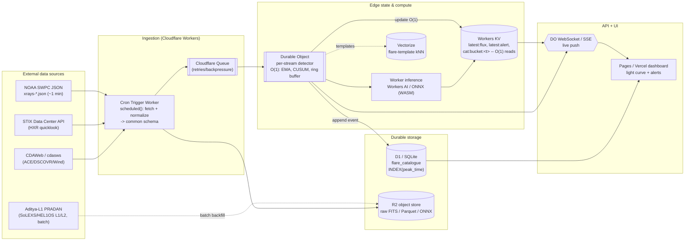

# 05 — Data Access & Fast O(1) Platform Architecture

**Project:** ISRO BAH 2026 — Problem 15 (Solar flare nowcast/forecast from Aditya‑L1 SoLEXS + HEL1OS plus 30+ supplementary satellites)
**Scope of this doc:** (A) concrete, code‑level programmatic data access for the full constellation; (B) a fast, real‑time, edge‑first deployment architecture with O(1) catalogue lookups and low‑latency alerting.
**Date:** 2026‑06‑20
**Verification convention:** URLs I confirmed via live fetch/search are marked **(verified)**. URLs reconstructed from documented patterns but not individually opened are marked **(verify)** — treat them as "almost certainly right, but check before hardcoding."

> Design north star from the project lead: *"FASTEST PLATFORM, O(1) techniques."* The architecture below makes the **hot path** (latest flux, latest alert, catalogue‑by‑time, streaming detector state) genuinely O(1) using key/value and per‑stream stateful objects, while keeping bulk/archival science on cheap object storage. The phrase "O(1)" is used precisely (see §2.7), not as marketing.

---

## PART 1 — DATA ACCESS

### 1.0 Philosophy: two access tiers

There are two fundamentally different access modes, and conflating them is the most common mistake:

1. **Real‑time / nowcast tier (seconds–minutes latency):** small JSON polled directly. This is the *only* tier that matters for the live alerting hot path. Source of truth = **NOAA SWPC `services.swpc.noaa.gov/json/...`** for GOES XRS, plus per‑mission quick‑look APIs (STIX). Aditya‑L1 SoLEXS/HEL1OS real‑time is **not** publicly streamed — it arrives via ISSDC PRADAN as Level‑1/Level‑2 science products after processing, so for the *live* nowcast GOES XRS is the operational driver and Aditya‑L1 is the science/training/validation driver.
2. **Archive / science / training tier (hours–quarters latency):** big FITS/NetCDF/CDF retrieved programmatically via **SunPy Fido**, **cdasws**, **drms**, **stixdcpy**, **astropy**, and direct HTTPS bulk pulls. This is the tier for model training, backtesting, and ground‑truth labelling.

The unifying glue is **SunPy `Fido`** (federated search across VSO, JSOC, HEK, CDAWeb, GOES/XRS, RHESSI, GONG, e‑Callisto) plus **astropy** for FITS I/O. Where Fido has no client (Aditya‑L1 PRADAN, STIX Data Center, raw SWPC JSON) you go direct.

### 1.1 SunPy / Fido unified search

`Fido` (`sunpy.net.Fido`) is a federated client: one `Fido.search(...)` query is dispatched to whichever underlying client matches the attributes. Attributes live in `sunpy.net.attrs` (aliased `a`). Key clients and the attributes that route to them:

| Underlying client | Routed by attributes | Typical product |
|---|---|---|
| **XRSClient** (`sunkit-instruments`/dataretriever) | `a.Instrument("XRS")` (+ `a.goes.SatelliteNumber`, `a.Resolution`) | GOES XRS 1‑s / 1‑min light curves |
| **VSOClient** (Virtual Solar Observatory) | `a.Instrument("AIA"/"EIT"/"LASCO"...)`, `a.Wavelength`, `a.Physobs` | SDO/AIA, SOHO, STEREO images |
| **JSOCClient** | `a.jsoc.Series`, `a.jsoc.Notify` (email registration required) | HMI/AIA Lev1/1.5 via DRMS |
| **HEKClient** | `a.hek.EventType`, `a.hek.FL.*`, `a.hek.OBS.*` | Event catalogue (flares = ground truth) |
| **CDAWEBClient** | `a.cdaweb.Dataset` | ACE/DSCOVR/Wind in‑situ CDF |
| **RHESSIClient** | `a.Instrument("RHESSI")` | RHESSI observing summary / flare list |
| **GONGClient** | `a.Instrument("GONG")`, `a.Physobs("LOS_MAGNETIC_FIELD")` | GONG magnetograms / synoptic maps |
| **eveClient** | `a.Instrument("EVE")`, `a.Level` | SDO/EVE irradiance |
| **NOAAIndicesClient / SRSClient** | `a.Instrument("NOAAIndices"/"SOON"/"SRS")` | F10.7, sunspot regions (SRS), predicted indices |

Install: `pip install "sunpy[all]" sunkit-instruments drms cdasws stixdcpy astropy`.

```python
import astropy.units as u
from sunpy.net import Fido, attrs as a

# Federated example: one query, multiple instruments around an event window
res = Fido.search(
    a.Time("2024-05-10 00:00", "2024-05-11 00:00"),
    a.Instrument("XRS") | a.Instrument("AIA"),   # logical OR -> two clients
)
print(res)                 # UnifiedResponse: one results block per client
# files = Fido.fetch(res)  # downloads everything; returns local paths
```

### 1.2 GOES XRS — the operational nowcast driver (real‑time JSON + L2 science + flare event list)

This is the most important section for the live system. GOES XRS gives the canonical 0.1–0.8 nm (1–8 Å, "long") and 0.05–0.4 nm (0.5–4 Å, "short") soft‑X‑ray flux, and the **A/B/C/M/X flare class** is defined directly from the long‑channel peak flux (A = 1e‑8, B = 1e‑7, C = 1e‑6, M = 1e‑5, X = 1e‑4 W m⁻²).

**(a) Real‑time SWPC JSON (the hot path).** Directory `https://services.swpc.noaa.gov/json/goes/primary/` **(verified)** contains (exact filenames **verified** by directory listing):

- `xrays-6-hour.json`, `xrays-1-day.json`, `xrays-3-day.json`, `xrays-7-day.json` — time series of both energy bands.
- `xray-flares-latest.json`, `xray-flares-7-day.json` — SWPC‑detected flare events with begin/peak/end and class.
- `xray-background-7-day.json` — background level.
- (Same directory also has `integral-protons-*.json`, `integral-electrons-*.json` for SEP context.)
- Secondary GOES satellite mirror: `https://services.swpc.noaa.gov/json/goes/secondary/...` **(verify)**.
- Supporting maps: `instrument-sources.json`, `satellite-longitudes.json` (under `/json/goes/`) **(verify)**.

JSON record schema (**verified** field semantics): each element is a flat object roughly:
```json
{"time_tag":"2026-06-20T12:00:00Z","satellite":16,"flux":3.1e-6,"observed_flux":3.1e-6,
 "electron_correction":0.0,"electron_contaminaton":false,"energy":"0.1-0.8nm"}
```
Each timestamp appears **twice** (once per `energy` band: `"0.1-0.8nm"` and `"0.05-0.4nm"`). Cadence ≈ **1 minute** (operational averaged product); files updated continuously. No auth, CORS‑friendly → pollable directly from a Cloudflare Worker.

```python
# Pure-stdlib pull of the real-time long-channel flux + current flare class.
# Works in restricted envs (no SunPy). This is exactly what the Worker mirrors.
import json, math, urllib.request

URL = "https://services.swpc.noaa.gov/json/goes/primary/xrays-6-hour.json"  # verified path

def flare_class(flux_wm2: float) -> str:
    if flux_wm2 is None or flux_wm2 <= 0:
        return "Q"  # quiet / no data
    # class letter by decade of long-channel flux (W m^-2)
    bands = [("X", 1e-4), ("M", 1e-5), ("C", 1e-6), ("B", 1e-7), ("A", 1e-8)]
    for letter, base in bands:
        if flux_wm2 >= base:
            return f"{letter}{flux_wm2 / base:.1f}"
    return "A<1.0"

with urllib.request.urlopen(URL, timeout=15) as r:
    data = json.load(r)

# keep only the long channel (the channel that defines flare class)
long = [d for d in data if d.get("energy") == "0.1-0.8nm" and d.get("flux") is not None]
long.sort(key=lambda d: d["time_tag"])
latest = long[-1]
print(latest["time_tag"], latest["flux"], "->", flare_class(latest["flux"]))
```

**(b) GOES XRS L2 science NetCDF (training / backtest ground truth).** Science‑quality, recalibrated. NCEI tree (**verified** path):
`https://data.ngdc.noaa.gov/platforms/solar-space-observing-satellites/goes/goes16/l2/data/xrsf-l2-flx1s_science/` (swap `goes16`→`goes17`/`goes18`; product dirs include `xrsf-l2-flx1s_science` 1‑s, `xrsf-l2-avg1m_science` 1‑min, and **flare summaries**). Read with `xarray`/`netCDF4` or astropy. Docs: `GOES-R_XRS_L2_Data_Users_Guide.pdf` and `GOES_Flare_Report_ReadMe.pdf` in the `.../l2/docs/` dir **(verified)**.

**(c) GOES XRS via SunPy (clean API for archive + into a TimeSeries).**

```python
import astropy.units as u
from sunpy.net import Fido, attrs as a
import sunpy.timeseries as ts

result = Fido.search(
    a.Time("2017-09-06 00:00", "2017-09-07 00:00"),  # the X9.3 event day
    a.Instrument.xrs,
    a.goes.SatelliteNumber(16),
    a.Resolution("flx1s"),        # high-cadence; use "avg1m" for 1-minute
)
files = Fido.fetch(result)
goes = ts.TimeSeries(files, source="XRS", concatenate=True)
df = goes.to_dataframe()          # columns: xrsa (short), xrsb (long)
peak = df["xrsb"].max()           # long-channel peak -> flare class
```

**(d) SWPC edited event list (canonical A–X labels, human‑reviewed).** The "Solar and Geophysical Event Reports" (updated ~every 30 min) are the forecaster‑reviewed truth; also mirrored historically at NCEI "Solar Flares and Events." Prefer **HEK GOES flare list** (§1.6) for programmatic labels.

### 1.3 NASA CDAWeb / `cdasws` — in‑situ (ACE, DSCOVR, Wind, and ~hundreds of missions)

In‑situ solar‑wind/IMF context (useful as forecast features and for SEP). `cdasws` is the Python wrapper over the CDAS REST service; can return SpacePy, **xarray.Dataset**, or **pandas**.

```python
from cdasws import CdasWs
cdas = CdasWs()

# Discover datasets for an observatory group
# cdas.get_datasets(observatoryGroup="ACE")

# DSCOVR real-time-ish magnetometer (1-min); dataset IDs are CDAWeb canonical names
status, data = cdas.get_data(
    "DSCOVR_H0_MAG",                       # verify exact dataset id in get_datasets()
    ["B1GSE"],
    "2024-05-10T00:00:00Z", "2024-05-10T06:00:00Z",
)
# data is a SpacePy dict-like; or request xarray:
# data = cdas.get_data(..., dataRepresentation="xarray")
```
Common IDs (**verify** against `get_datasets()`): `AC_H0_MFI`, `AC_H0_SWE` (ACE), `WI_H0_MFI` (Wind), `DSCOVR_H0_MAG`, `DSCOVR_H1_FC` (DSCOVR Faraday cup). Endpoint base: `https://cdaweb.gsfc.nasa.gov/WS/cdasr/1/` **(verify)**. Also reachable via `Fido` `a.cdaweb.Dataset(...)`.

### 1.4 SDO JSOC / `drms` (HMI/AIA) and EVE irradiance

**`drms`** talks to JSOC's HTTP/JSON DRMS interface: query metadata, submit export, download tailored FITS. Export requests that download files require an **email registered with JSOC** (`notify=`).

```python
import drms
client = drms.Client(email="you@example.org")  # email must be JSOC-registered

# Metadata only (no export, no auth): AIA 193 Å keywords for one hour
keys = client.query(
    "aia.lev1_euv_12s[2014-01-01T00:00:00Z/1h@5m][193]",
    key="T_REC, QUALITY, EXPTIME, WAVELNTH",
)

# Tailored FITS export of HMI line-of-sight magnetogram
exp = client.export("hmi.M_720s[2014-01-01_00:00:00_TAI]", method="url", protocol="fits")
exp.wait(); paths = exp.download("/tmp/hmi")
```
**EVE** (solar EUV irradiance, flare energetics): via `Fido` (`a.Instrument("EVE")`, `a.Level("0CS")` for the daily‑updated ESP/MEGS‑P quicklook) or LASP `lisird`. EVE flare lines (e.g. Fe) are strong nowcast features.

### 1.5 Solar Orbiter STIX, Fermi GBM, RHESSI (hard X‑ray)

Hard‑X‑ray (HXR) anticipates/co‑times the soft‑X‑ray flare and helps non‑thermal classification.

- **STIX Data Center** (`datacenter.stix.i4ds.net` **(verified)**) — HTTP APIs over a NoSQL store: quick‑look light curves, science data, **STIX flare list**, ephemeris. Python: **`stixdcpy`** (`pip install stixdcpy`, repo `i4Ds/stixdcpy` **(verified)**).
  ```python
  from stixdcpy.net import Request as jreq            # API surface; verify class names
  lc = jreq.fetch_light_curves("2024-05-10T00:00:00", "2024-05-10T06:00:00")
  # flare list, housekeeping, science products via analogous fetch_* calls
  ```
- **Fermi GBM daily data** — continuous count rates regardless of trigger; HEASARC table **`FERMIGDAYS`** (`heasarc.gsfc.nasa.gov/W3Browse/fermi/fermigdays.html` **(verified)**) and FTP `https://heasarc.gsfc.nasa.gov/FTP/fermi/data/gbm/daily/YYYY/MM/DD/` **(verify)**. Read CSPEC/CTIME FITS with astropy.
- **RHESSI** (2002–2018 HXR archive, historical training only) — `Fido` `a.Instrument("RHESSI")` for the observing‑summary/flare list, or bulk from **`https://hesperia.gsfc.nasa.gov/hessidata/`** **(verified)**.

### 1.6 HEK and HELIO/HEC — event catalogues (the ground truth)

**HEK** is the primary programmatic flare catalogue (folds in the SWPC/GOES flare list, FRM = `SWPC`/`SSW Latest Events`). Query via `Fido` with `a.hek.*`. This is how you build labels for supervised training and for nowcast verification.

```python
from sunpy.net import Fido, attrs as a

res = Fido.search(
    a.Time("2017-09-01", "2017-09-30"),
    a.hek.EventType("FL"),                       # FL = flare
    a.hek.FL.GOESCls > "M1.0",                   # string-comparable GOES class
    a.hek.OBS.Observatory == "GOES",
)
hek = res["hek"]
labels = hek["event_starttime", "event_peaktime", "event_endtime",
             "fl_goescls", "hpc_x", "hpc_y", "ar_noaanum"]
# -> ground-truth flare table (start/peak/end, class, position, active region)
```
**HELIO / HEC** (Heliophysics Event Catalogue, EU): complementary event lists (CME, type‑II/III bursts) via the `helio`/`sunpy-soar`‑adjacent tooling or HELIO TAP services **(verify)** — useful for multi‑messenger labels.

### 1.7 Aditya‑L1 via ISSDC PRADAN (SoLEXS + HEL1OS) — the mission payload

Aditya‑L1 science data are disseminated through ISRO's **PRADAN** portal (**verified**): `https://pradan.issdc.gov.in/al1/` (alt host `https://pradan1.issdc.gov.in/al1/`). **Registration/login required**; access is **interactive/bulk download by instrument and date**, not a streaming API. Payloads: **SoLEXS** (soft‑X‑ray, 1–22 keV — direct analogue to GOES XRS and the *primary* flare channel for this project), **HEL1OS** (hard‑X‑ray), ASPEX, PAPA, MAG, SUIT, VELC. Two science‑quality data releases were made through 2025 (**verified** via SolarNews/ASI). Products are FITS (Level‑1/Level‑2) with light curves + spectra.

**Access pattern:** (1) register on PRADAN → (2) browse by payload + date → (3) download FITS (or use the bulk/HTTPS endpoints exposed after login). Because login is session‑based, automate with an authenticated `requests.Session` (cookies) **(verify the exact form/endpoints from the portal after login)** — do **not** assume an open REST API.

```python
# Read a downloaded Aditya-L1 SoLEXS/HEL1OS Level-1 FITS light curve with astropy.
from astropy.io import fits
from astropy.table import Table
import astropy.units as u

with fits.open("AL1_SoLEXS_L1_lightcurve.fits") as hdul:  # filename illustrative
    hdul.info()                       # inspect HDUs: PRIMARY + binary tables
    lc = Table(hdul[1].data)          # typically a BINTABLE: TIME, RATE, etc.
    hdr = hdul[1].header
print(lc.colnames)
# Convert mission epoch -> astropy Time using header keywords (MJDREF/TIMESYS/TIMEUNIT)
```

### 1.8 e‑CALLISTO (radio bursts) and GONG (magnetograms)

- **e‑CALLISTO** — global low‑frequency radio spectrometer network; **type II/III bursts** are early CME/flare signatures. Archive: `https://www.e-callisto.org/Data/data.html` **(verified)**; files are `*.fit.gz` (FITS spectrograms: intensity matrix + freq + time axes). Read with astropy `fits`. (2026 tooling: "e‑CALLISTO FITS Analyzer" framework on arXiv.)
- **GONG** — full‑disk LOS magnetograms (~1 min) and Hα (~20 s); active‑region magnetic complexity is a leading flare predictor. Via `Fido` `GONGClient` (`a.Instrument("GONG")`, `a.Physobs("LOS_MAGNETIC_FIELD")`) or NSO `gong2.nso.edu` / `nispdata` **(verify)**.

### 1.9 Master data‑source table

| Source | Library / API | Endpoint / portal | Cadence | Auth | Notes |
|---|---|---|---|---|---|
| **GOES XRS real‑time** | stdlib `urllib`/`requests`; Worker `fetch` | `services.swpc.noaa.gov/json/goes/primary/xrays-*.json` **(verified)** | ~1 min | none | **Operational nowcast driver.** Two bands per ts. Hot path. |
| **GOES flare events (SWPC)** | `requests` | `.../json/goes/primary/xray-flares-{latest,7-day}.json` **(verified)** | event | none | SWPC‑detected begin/peak/end + class. |
| **GOES XRS L2 science** | `xarray`/`netCDF4`, astropy | `data.ngdc.noaa.gov/platforms/.../goes16/l2/data/xrsf-l2-*` **(verified)** | 1 s / 1 min | none | Recalibrated; training/backtest truth + flare summaries. |
| **GOES XRS (federated)** | SunPy `Fido` + `sunkit-instruments` | `a.Instrument.xrs` | 1 s / 1 min | none | Cleanest archive→`TimeSeries`. |
| **SDO AIA / HMI** | `drms`; SunPy `Fido` (JSOC/VSO) | `jsoc.stanford.edu` DRMS | 12 s (AIA) / 720 s (HMI) | email reg (export) | Imaging context, AR magnetograms. |
| **SDO EVE** | SunPy `Fido`; LASP LISIRD | `a.Instrument("EVE")` / `lasp.colorado.edu/lisird` | minutes | none | EUV irradiance, flare energetics. |
| **ACE / DSCOVR / Wind** | `cdasws`; SunPy `Fido` | `cdaweb.gsfc.nasa.gov/WS/cdasr/` **(verify)** | 1–60 s | none | In‑situ solar‑wind/IMF + SEP context. |
| **Solar Orbiter STIX** | `stixdcpy` | `datacenter.stix.i4ds.net` **(verified)** | QL ~ minutes | none (most) | HXR light curves + **STIX flare list**. |
| **Fermi GBM (daily)** | astropy; HEASARC Browse/FTP | `heasarc.gsfc.nasa.gov/.../fermigdays` **(verified)** | continuous | none | HXR/γ continuous rates. |
| **RHESSI** | SunPy `Fido`; HTTPS bulk | `hesperia.gsfc.nasa.gov/hessidata/` **(verified)** | 2002–2018 | none | Historical HXR training. |
| **HEK (flare catalogue)** | SunPy `Fido` `a.hek.*` | LMSAL HEK service | event | none | **Primary ground‑truth labels.** |
| **HELIO / HEC** | HELIO TAP / `sunpy` adj. | HELIO services **(verify)** | event | none | CME / radio‑burst event lists. |
| **Aditya‑L1 SoLEXS/HEL1OS** | `requests` (session) + astropy FITS | `pradan.issdc.gov.in/al1/` **(verified)** | L1/L2 batches | **login** | **Mission payload.** Bulk download, not streaming. |
| **e‑CALLISTO** | astropy FITS; `Fido` (eve‑adjacent) | `e-callisto.org/Data/data.html` **(verified)** | event (`*.fit.gz`) | none | Type II/III radio = early CME signal. |
| **GONG** | SunPy `Fido` `GONGClient` | `gong2.nso.edu` / NSO NISP **(verify)** | ~1 min (mag) | none | AR magnetic complexity → flare precursor. |
| **NOAA SRS / F10.7** | SunPy `Fido` (`SRS`, `NOAAIndices`) | SWPC/NGDC | daily | none | Active‑region table, solar index features. |

---

## PART 2 — FAST O(1) PLATFORM ARCHITECTURE

### 2.0 Goals → design constraints

| Goal | Constraint it imposes |
|---|---|
| Real‑time nowcast (sub‑minute) | Ingest cadence ≤ source cadence; push, don't poll, to clients |
| "O(1) techniques" / fastest | Hot‑path reads must be key/value (KV / Durable Object memory), not table scans; detector must be O(1) per sample |
| Edge‑capable, global, cheap | Serverless edge compute + object storage; no always‑on VM |
| Works offline in this sandbox (no creds/network) | A self‑contained local fallback stack that needs nothing external |

### 2.1 Recommended stack (Cloudflare‑first, edge‑native)

| Layer | Component | Why |
|---|---|---|
| **Ingestion** | **Workers Cron Triggers** (`scheduled()`), optionally fanned through **Cloudflare Queues** | Cron pulls SWPC JSON + STIX + cdasws‑proxied feeds on each cadence; Queues decouple fetch from processing and give retries/backpressure. |
| **Hot state (O(1))** | **Workers KV** + **Durable Objects** | KV: globally‑replicated key→value, **sub‑10 ms reads** (writes propagate ~60 s) — perfect for `latest:flux`, `latest:alert`, `cat:bucket:<t>`. DO: single‑instance, in‑memory, strongly consistent per‑stream **online detector state**. |
| **Catalogue (queryable)** | **Cloudflare D1** (serverless SQLite) | Relational flare catalogue with a **time index** for range queries / backtests; strong consistency. Complements (not replaces) KV. |
| **Bulk / raw** | **Cloudflare R2** (S3‑compatible, **no egress fees**) | Raw FITS, Parquet light curves, model artifacts (ONNX). |
| **Similarity (optional)** | **Vectorize** | Embed flare‑shape templates; nearest‑neighbour "this looks like the 2017‑09‑06 pre‑flare rise." |
| **Inference** | **Workers AI** or a small **ONNX model in a Worker** (WASM `onnxruntime-web`) | Edge forecast at ingest time; DO holds streaming detector. |
| **API + live push** | **Durable Object WebSocket / SSE**; **Pages** (or **Vercel**) dashboard | DO fans out live updates via **Hibernatable WebSockets** (sleeps while holding the socket → cheap); SSE for simple unidirectional. |
| **UI** | **Cloudflare Pages** or **Vercel** (Next.js edge) | Light‑curve chart + alert banner; subscribes to the live stream. |

> **Why two stores (KV *and* D1)?** They are not redundant. KV is the **O(1) hot cache** (one key → one value, no scan). D1 is the **queryable system of record** (range/aggregate over the catalogue). The pattern: writer updates **both** — KV for instant lookups, D1 for analytics/backtests. This is the standard Cloudflare "KV for reads, D1 for queries" split.

### 2.2 Architecture diagram (Mermaid)



### 2.3 Ingestion (normalize to a common schema)

Every source is mapped to one canonical record so the detector and UI are source‑agnostic:

```ts
// common schema (one sample of one stream)
type FluxSample = {
  stream: string;        // "goes-primary-long" | "goes-primary-short" | "stix-ql" | ...
  t: number;             // epoch ms (UTC)
  flux: number;          // W m^-2 (or instrument-native; record unit)
  unit: string;          // "W m^-2"
  source: string;        // "SWPC" | "STIX" | "AdityaL1-SoLEXS"
  cls?: string;          // derived flare class, e.g. "C3.1"
};
```

```ts
// Cron Worker (wrangler: triggers.crons = ["* * * * *"])  -- pull SWPC each minute
export default {
  async scheduled(_evt: ScheduledEvent, env: Env, ctx: ExecutionContext) {
    const url = "https://services.swpc.noaa.gov/json/goes/primary/xrays-6-hour.json"; // verified
    const raw = await (await fetch(url, { cf: { cacheTtl: 30 } })).json<any[]>();
    const longCh = raw.filter(d => d.energy === "0.1-0.8nm" && d.flux != null)
                      .sort((a, b) => a.time_tag.localeCompare(b.time_tag));
    const last = longCh.at(-1);
    if (!last) return;
    const sample: FluxSample = {
      stream: "goes-primary-long", t: Date.parse(last.time_tag),
      flux: last.flux, unit: "W m^-2", source: "SWPC", cls: flareClass(last.flux),
    };
    // route to the per-stream Durable Object (one DO instance per stream id)
    const id = env.DETECTOR.idFromName(sample.stream);
    ctx.waitUntil(env.DETECTOR.get(id).fetch("https://do/ingest",
      { method: "POST", body: JSON.stringify(sample) }));
  },
};

function flareClass(f: number): string {
  for (const [L, b] of [["X",1e-4],["M",1e-5],["C",1e-6],["B",1e-7],["A",1e-8]] as const)
    if (f >= b) return `${L}${(f / b).toFixed(1)}`;
  return "A<1.0";
}
```

### 2.4 The O(1) streaming detector (Durable Object)

One DO **per stream** holds tiny constant‑size state and updates in O(1) per sample. It does **EMA** (smoothing/background), **CUSUM** (change‑point → flare onset), a fixed‑size **ring buffer** (last N samples for the UI), and writes the O(1) hot keys to KV. No history scan, ever.

```ts
export class Detector implements DurableObject {
  state: DurableObjectState; env: Env;
  // constant-size in-memory state -> O(1) updates
  ema = 0; emaInit = false; cusumPos = 0; bg = 0;
  ring: FluxSample[] = []; readonly N = 360;          // last ~6h at 1/min
  sockets = new Set<WebSocket>();
  constructor(s: DurableObjectState, e: Env) { this.state = s; this.env = e; }

  async fetch(req: Request): Promise<Response> {
    const u = new URL(req.url);
    if (u.pathname === "/ws") return this.accept(req);     // live push
    if (u.pathname === "/ingest") return this.ingest(await req.json<FluxSample>());
    return new Response("ok");
  }

  async ingest(s: FluxSample): Promise<Response> {
    const alpha = 0.2, k = 0.5, H = 5;                      // EMA + CUSUM params
    if (!this.emaInit) { this.ema = s.flux; this.bg = s.flux; this.emaInit = true; }
    else this.ema = alpha * s.flux + (1 - alpha) * this.ema;            // O(1)
    const sigma = Math.max(this.bg * 0.25, 1e-9);
    this.cusumPos = Math.max(0, this.cusumPos + (s.flux - this.bg) / sigma - k); // O(1)
    const alerting = this.cusumPos > H;
    if (!alerting) this.bg = 0.01 * s.flux + 0.99 * this.bg;            // slow background
    this.ring.push(s); if (this.ring.length > this.N) this.ring.shift(); // O(1) amortized

    // O(1) hot-path writes: latest sample, latest alert, time-bucketed catalogue key
    const bucket = Math.floor(s.t / 3_600_000);                         // 1-hour bucket
    await Promise.all([
      this.env.KV.put(`latest:${s.stream}`, JSON.stringify(s)),
      alerting && this.env.KV.put(`alert:${s.stream}`,
        JSON.stringify({ ...s, cusum: this.cusumPos, at: Date.now() })),
      this.env.KV.put(`cat:${s.stream}:${bucket}`, JSON.stringify(s)),  // O(1) by-time
    ].filter(Boolean) as Promise<void>[]);

    if (alerting) {                                                     // durable record
      await this.env.DB.prepare(
        "INSERT INTO flare_catalogue(stream,peak_time,flux,cls,cusum) VALUES(?,?,?,?,?)")
        .bind(s.stream, s.t, s.flux, s.cls ?? null, this.cusumPos).run();
    }
    this.broadcast({ type: alerting ? "alert" : "sample", sample: s });  // live push
    return new Response("ok");
  }

  accept(req: Request): Response {                          // Hibernatable WebSocket
    const pair = new WebSocketPair(); const [client, server] = Object.values(pair);
    this.state.acceptWebSocket(server); this.sockets.add(server);
    return new Response(null, { status: 101, webSocket: client });
  }
  broadcast(msg: unknown) { const m = JSON.stringify(msg);
    for (const ws of this.sockets) try { ws.send(m); } catch {} }
}
```

### 2.5 API for O(1) reads

```ts
// Front Worker: every read here is a single KV GET -> O(1), sub-10ms.
export default {
  async fetch(req: Request, env: Env) {
    const u = new URL(req.url);
    if (u.pathname === "/latest")                                   // ?stream=goes-primary-long
      return json(await env.KV.get(`latest:${u.searchParams.get("stream")}`, "json"));
    if (u.pathname === "/alert")
      return json(await env.KV.get(`alert:${u.searchParams.get("stream")}`, "json"));
    if (u.pathname === "/at") {                                     // catalogue by time -> O(1)
      const bucket = Math.floor(Number(u.searchParams.get("t")) / 3_600_000);
      return json(await env.KV.get(`cat:${u.searchParams.get("stream")}:${bucket}`, "json"));
    }
    if (u.pathname === "/stream") {                                 // upgrade to live WS via DO
      const id = env.DETECTOR.idFromName(u.searchParams.get("stream")!);
      return env.DETECTOR.get(id).fetch(new Request("https://do/ws", req));
    }
    return new Response("not found", { status: 404 });
  },
};
const json = (v: unknown) => new Response(JSON.stringify(v ?? null),
  { headers: { "content-type": "application/json" } });
```

D1 schema for the **range‑query** side (backtests, "show all M+ flares last month"):
```sql
CREATE TABLE IF NOT EXISTS flare_catalogue (
  id INTEGER PRIMARY KEY, stream TEXT, peak_time INTEGER,  -- epoch ms
  flux REAL, cls TEXT, cusum REAL);
CREATE INDEX IF NOT EXISTS idx_cat_time ON flare_catalogue(peak_time);  -- range queries
CREATE INDEX IF NOT EXISTS idx_cat_cls  ON flare_catalogue(cls);
```

### 2.6 Edge inference

- **Lightweight, always‑on:** the EMA/CUSUM detector in the DO **is** the nowcast — pure arithmetic, O(1), no model load.
- **Short‑horizon forecast (e.g., 10–60 min ahead "flux will exceed M1"):** train offline (sklearn/PyTorch on GOES L2 + Aditya‑L1 SoLEXS labels from HEK), export to **ONNX**, store in **R2**, run in a Worker via `onnxruntime-web` (WASM), or call **Workers AI** for a hosted model. Inference is fed the DO's ring buffer → constant‑size input → bounded latency.
- **Similarity:** embed the last‑N‑minute curve, `Vectorize.query()` against labelled pre‑flare templates → "analogous to past X‑class onset."

### 2.7 Why this is genuinely "O(1)" (the precise claim)

| Operation | Complexity | Mechanism |
|---|---|---|
| Read latest flux / latest alert | **O(1)** | single **KV GET** by key (hash lookup; no scan) |
| Read catalogue at time *t* | **O(1)** | key = `cat:<stream>:<hour-bucket>` → one KV/DO get; time bucketing makes "by time" a direct key, not a search |
| Detector update per sample | **O(1)** | EMA, CUSUM, background, and ring‑buffer push are constant‑time arithmetic on constant‑size state held in DO memory |
| Live fan‑out to a client | **O(1)** per client message | DO holds the WebSocket; broadcast is O(#subscribers), each send O(1) |
| Per‑stream isolation | **O(1)** routing | `idFromName(stream)` deterministically maps to one DO; no global lock/scan |

What is **not** O(1) (and shouldn't be forced to be): historical **range/aggregate** queries over the catalogue are O(log n + k) via the D1 `peak_time` index — that's the right tool for backtests. The *hot path* (nowcast, latest, alert, by‑time) is O(1); the *analytics path* is indexed. Claiming O(1) for arbitrary range scans would be false, so we deliberately split them.

> Honest caveat: KV writes are eventually consistent (propagate ~60 s globally). For the live alert the DO broadcast is **immediate**; KV is the durable O(1) cache for *other* edge reads. Where read‑your‑write matters, read from the DO (strongly consistent) instead of KV.

### 2.8 Alternative simple stack (local / offline demo — no cloud, no creds)

For this sandbox (which may lack network/credentials) and for judges to run locally:

| Layer | Local component |
|---|---|
| Ingest | Python script / APScheduler polling cached SWPC JSON (or a bundled sample file) |
| Store | **DuckDB** (or stdlib **SQLite**) — same `flare_catalogue` schema; DuckDB reads Parquet/CSV light curves directly |
| Detector | The **same** EMA/CUSUM logic in ~30 lines of Python (identical math to the DO) |
| API | **FastAPI** with an `/sse` endpoint (`text/event-stream`) for live push |
| UI | **Streamlit** or **Plotly Dash** — light curve + alert banner; or a static HTML page consuming the SSE feed |

```python
# Offline-capable nowcast: identical EMA/CUSUM, SQLite catalogue, Plotly. No network needed
# if you point URL at a local cached file.
import json, sqlite3, urllib.request, urllib.error

ALPHA, K, H = 0.2, 0.5, 5.0
def flare_class(f):
    for L, b in (("X",1e-4),("M",1e-5),("C",1e-6),("B",1e-7),("A",1e-8)):
        if f >= b: return f"{L}{f/b:.1f}"
    return "A<1.0"

def load(url="https://services.swpc.noaa.gov/json/goes/primary/xrays-1-day.json"):
    try:
        with urllib.request.urlopen(url, timeout=15) as r: data = json.load(r)
    except (urllib.error.URLError, OSError):
        with open("xrays-1-day.json") as fh: data = json.load(fh)   # offline fallback
    rows = [d for d in data if d.get("energy") == "0.1-0.8nm" and d.get("flux")]
    rows.sort(key=lambda d: d["time_tag"]); return rows

def run(rows):
    db = sqlite3.connect(":memory:")
    db.execute("CREATE TABLE flares(t TEXT, flux REAL, cls TEXT, cusum REAL)")
    ema = bg = rows[0]["flux"]; cusum = 0.0; out = []
    for d in rows:
        f = d["flux"]; ema = ALPHA*f + (1-ALPHA)*ema
        sigma = max(bg*0.25, 1e-9); cusum = max(0.0, cusum + (f-bg)/sigma - K)
        alerting = cusum > H
        if not alerting: bg = 0.01*f + 0.99*bg
        else: db.execute("INSERT INTO flares VALUES(?,?,?,?)",
                          (d["time_tag"], f, flare_class(f), cusum))
        out.append((d["time_tag"], f, ema, cusum, alerting))
    db.commit()
    print("detected onsets:", db.execute("SELECT count(*) FROM flares").fetchone()[0])
    return out

if __name__ == "__main__":
    run(load())
# FastAPI: @app.get('/sse') -> StreamingResponse(gen(), media_type='text/event-stream')
# Streamlit: st.plotly_chart of (t, flux) with alert markers where cusum>H.
```

The crucial property: **the detector math is identical** in the edge (DO) and local (Python) stacks, so a local demo is a faithful preview of production. Only the substrate (KV/DO/D1 ↔ dict/SQLite) differs.

---

## Recommended platform stack (summary)

- **Ingestion:** Cloudflare **Workers Cron Triggers** (1‑min `scheduled()`) pulling **SWPC `xrays-*.json`** (verified endpoints) + STIX/cdasws feeds, normalized to one `FluxSample` schema, optionally buffered through **Queues**.
- **Hot O(1) layer:** **Workers KV** for `latest:*`, `alert:*`, and time‑bucketed `cat:*` keys (single‑GET, sub‑10 ms); **Durable Objects** (one per stream) holding constant‑size **EMA + CUSUM + ring‑buffer** state updated **O(1) per sample** and fanning out alerts over **Hibernatable WebSockets/SSE**.
- **Queryable catalogue:** **D1 (SQLite)** with a `peak_time` index for backtests/range queries (the analytics path; O(log n + k), deliberately separate from the O(1) hot path).
- **Bulk/raw + models:** **R2** (FITS, Parquet light curves, ONNX artifacts); **Vectorize** optional for flare‑template similarity.
- **Inference:** detector itself is the always‑on O(1) nowcast; short‑horizon forecast via **ONNX‑in‑Worker** or **Workers AI**, fed the DO ring buffer.
- **UI:** **Cloudflare Pages** (or **Vercel** edge) dashboard subscribing to the live DO stream.
- **Offline fallback (this sandbox / judges):** **FastAPI + SQLite/DuckDB + Streamlit/Plotly** running the **identical** EMA/CUSUM detector, with a local cached‑JSON fallback so it needs no network or credentials.

**Why fastest / O(1):** the entire nowcast hot path — latest flux, latest alert, catalogue‑by‑time, and per‑sample detection — is constant‑time (KV hash lookups + constant‑size DO state arithmetic), while the genuinely range‑shaped analytics queries are pushed to an indexed D1 table rather than being falsely advertised as O(1).
