# 06 — Multi-Satellite Data Fusion & Gap-Filling Layer

**ISRO BAH 2026 — Problem 15: Solar-flare nowcast/forecast from Aditya-L1 (SoLEXS + HEL1OS)**

> **Project-lead requirement (verbatim intent):** use 30+ satellites worldwide to *"verify and fill the gaps of the other datas."*
> This document specifies a rigorous **multi-satellite data-fusion layer** in which every dataset cross-checks and completes the others, producing a single best-estimate, uncertainty-tagged, fully provenanced flare light curve plus a consensus flare catalogue that trains and validates both the nowcast and the forecast.

**Status:** design specification (research deliverable). **Author role:** data-fusion & sensor-calibration scientist.
**Scope:** sections 1–8 below — common data model, time synchronization, cross-calibration, gap detection/filling, multi-viewpoint stereoscopy, consensus labeling, QC/provenance, validation. Includes math, a Mermaid pipeline diagram, the unified schema, and fusion pseudocode.

---

## 0. Design philosophy and the "constellation" we fuse

The fusion principle is **redundancy → robustness**. The Sun is a single physical source; dozens of spacecraft observe overlapping bands of its emission from different vantage points with different noise, cadence, dynamic range, and duty cycle. Treating each as a *noisy estimator of a shared latent state* lets us (a) reject what disagrees, (b) fill what is missing, and (c) shrink uncertainty where sources agree. This is the textbook setting for **inverse-variance fusion**, **Kalman/Bayesian sensor fusion**, and **consensus voting**.

### 0.1 The fusion constellation (representative > 30 platforms / instruments)

We organize sources by the **physical quantity** they constrain. Fusion only ever combines sources that estimate the *same* quantity (after cross-calibration); different quantities are *features*, not redundant measurements.

| Physical quantity | Primary (Aditya-L1) | Cross-check / gap-fill sources | Vantage |
|---|---|---|---|
| **Soft X-ray (SXR) flux**, 1–8 Å / 0.5–4 Å (W m⁻²) | **SoLEXS** (2–22 keV, 1 s) | GOES-16/17/18/19 XRS, Chandrayaan-2 XSM, GOES-R EXIS, MinXSS, FY-3/FY-4 X-ray, Kanopus, CSES | L1, GEO, lunar |
| **Hard X-ray (HXR) counts/flux** (counts s⁻¹, photons) | **HEL1OS** (10–150 keV) | Solar Orbiter STIX, Fermi GBM, Konus-WIND, Mars-Odyssey HEND, MESSENGER-class, ASO-S/HXI, Glory/SXR, GECAM | L1, 0.28–1 AU, Mars, GEO |
| **EUV irradiance / imaging** | (Aditya SUIT NUV; not EUV) | SDO/EVE + AIA, GOES EUVS, PROBA2/LYRA+SWAP, STEREO-A EUVI, Solar Orbiter EUI/FSI | GEO, L1, ahead-of-Earth, 0.28–1 AU |
| **Magnetograms / AR context** | (Aditya VELC corona) | SDO/HMI, GONG, SOLIS, Hinode/SOT, STEREO (proxy) | GEO, ground, ahead-of-Earth |
| **Radio dynamic spectra (precursors)** | — | e-Callisto net (ground, ~150 stations), WIND/WAVES, STEREO/SWAVES, Nançay, RSTN/Learmonth | ground + L1 + heliocentric |
| **In-situ energetic particles (SEP/proton)** | Aditya ASPEX/STEPS, HEL1OS background | GOES SEISS, ACE/EPAM, SOHO/ERNE, STEREO/HET, Parker/ISʘIS, SolO/EPD | L1, GEO, 0.05–1 AU |

> "30+ satellites" is satisfied by enumerating the operating platforms above (GOES alone contributes 3–4 active birds; e-Callisto is a *network*; the heliospheric fleet adds STEREO-A, Solar Orbiter, Parker, SOHO, ACE, WIND, SDO, PROBA2, ASO-S, GECAM, Konus-WIND, Fermi, Odyssey, Chandrayaan-2, MinXSS, etc.). The architecture is **source-agnostic**: a registry table (§7.2) lets new platforms be added without code changes.

**Three roles a source can play (per sample, per quantity):**
1. **Primary** — the instrument we are nowcasting on (Aditya-L1).
2. **Verifier** — independent same-quantity sensor used to confirm / reject events and to estimate Aditya's bias/gain.
3. **Filler** — best available substitute when the primary has a gap.

A source can switch roles dynamically (e.g., GOES is verifier when Aditya is healthy, filler when Aditya drops out).

---

## 1. Common data model (unified time-series schema)

### 1.1 Requirements

- Hold **heterogeneous** quantities: SXR flux (W m⁻²), HXR counts s⁻¹, EUV irradiance (W m⁻²), magnetogram-derived scalars, radio dynamic-spectrum bins (sfu vs frequency), in-situ proton flux (pfu).
- Carry **vantage-point geometry** so light-travel-time (LTT) correction is computable per sample.
- Carry **provenance, quality, and uncertainty** on every sample (non-negotiable for fusion).
- Be **append-only and lossless**: raw values are never overwritten; corrections are *additional columns*.

### 1.2 The canonical "fusion record" (long/tidy form)

One row = one sample of one quantity from one source. This tidy form trivially supports multi-cadence merges, pivoting to wide form per quantity, and per-source filtering.

```text
FusionRecord
├─ t_obs_utc        : float64  # raw on-board timestamp, converted to UTC (TAI-aware), seconds since J2000
├─ t_earth_utc      : float64  # LTT-corrected to common Earth-UT frame (see §1.4, §2)  ← fusion key
├─ source_id        : str      # e.g. "ADITYA_SOLEXS", "GOES18_XRSB", "SOLO_STIX_25-50keV"
├─ platform         : str      # "Aditya-L1","GOES-18","Solar Orbiter",...
├─ quantity         : enum     # SXR_LONG | SXR_SHORT | HXR | EUV | MAGSCALAR | RADIO | PROTON
├─ band             : str      # "1-8A","0.5-4A","25-50keV","30-48keV","171A","245MHz",">10MeV"
├─ value            : float64  # in canonical unit for the quantity (see §1.3)
├─ value_native     : float64  # original instrument unit (lossless audit)
├─ unit             : str      # canonical unit token
├─ sigma            : float64  # 1σ uncertainty in canonical unit (see §1.5) ← fusion weight source
├─ cadence_s        : float32  # nominal sample spacing of this stream (1,3,60,720,...)
├─ vantage_r_au     : float64  # heliocentric distance of spacecraft, AU  (for LTT)
├─ vantage_xyz_hci  : float64[3] # spacecraft position, Heliocentric Inertial (km) (for IPN/geometry)
├─ sub_sc_lon_deg   : float32  # Stonyhurst/Carrington longitude of sub-spacecraft point (for stereoscopy)
├─ qc_flag          : enum     # GOOD | INTERPOLATED | FILLED | SUSPECT | BAD (see §7)
├─ provenance       : str      # "measured" | "filled:GOES18" | "interp:linear" | "calibrated:v2.1"
├─ src_weight       : float32  # static reliability weight for this source/quantity (§7.2)
├─ cal_version      : str      # calibration/transfer-function version applied
└─ ingest_hash      : str      # content hash of raw record (reproducibility)
```

**Wide ("aligned") form** — produced *after* §2 synchronization, one row per common-grid timestamp, one column-group per quantity, used directly by the fusion estimator and the ML models:

```text
t_earth_utc | solexs_sxr | solexs_sxr_sigma | goes_sxrb | goes_sxrb_sigma | hel1os_hxr | stix_hxr | ... | qc_bitmask
```

### 1.3 Canonical units (everything is converted on ingest)

| Quantity | Canonical unit | Notes |
|---|---|---|
| SXR_LONG / SXR_SHORT | **W m⁻²** on the **GOES XRS scale** | SoLEXS spectrum → integrate over GOES band → scale to GOES (see §3) |
| HXR | **counts s⁻¹ in a reference band**, plus **photon flux** after spectral inversion | cross-cal to STIX/GBM reference (see §3.2) |
| EUV | W m⁻² (line or band) | irradiance; per-line where available |
| RADIO | solar flux units (sfu) per frequency bin | dynamic spectrum = 2-D (t, ν) |
| PROTON | particles cm⁻² s⁻¹ sr⁻¹ (pfu) per energy channel | for SEP context / despiking HXR |
| MAGSCALAR | derived scalars (total unsigned flux, R-value, Bz) | features, not fused as redundant |

### 1.4 Time standard, and why LTT correction is mandatory **before** fusion

All timestamps are stored in **UTC derived through TAI** (avoid leap-second ambiguity by storing seconds-since-J2000 TAI internally; render UTC for humans). But a UTC timestamp on two spacecraft does **not** mean the two saw the *same photons from the same flare* at that instant — because the spacecraft are at **different distances from the Sun**, the flare's light reaches them at different times.

> **The fusion key is `t_earth_utc`** = the time the flare's photons *would have* arrived at a common reference (we choose Earth/L1 distance, ~1 AU). Every stream is shifted to this frame so that a flare peak lines up across all sources to within sub-second. **Fusing on raw `t_obs_utc` would smear and misalign peaks by minutes** (Solar Orbiter example below: ~240 s), destroying both cross-calibration and event association.

#### Light-travel-time (LTT) correction — the math

Photons travel from the flare on the Sun's surface to spacecraft *k* over a path of length ≈ the Sun-spacecraft distance \( r_k \) (the flare is on the solar surface, so to first order subtract the solar radius \(R_\odot\); for fusion we work in the *heliocentric* frame and the \(R_\odot\) term cancels when we difference two spacecraft, so it is optional).

Arrival time at spacecraft *k* for a flash emitted at solar time \(t_\odot\):

$$
t_k = t_\odot + \frac{r_k - R_\odot}{c}
$$

To bring spacecraft *k* onto the **Earth reference frame** (reference distance \(r_\oplus \approx 1\,\text{AU}\)) we **subtract** the differential path:

$$
\boxed{\;\Delta t_{k\rightarrow\oplus} \;=\; \frac{r_\oplus - r_k}{c}\;,\qquad t_{\text{earth\_utc}} \;=\; t_{\text{obs\_utc}} \;+\; \Delta t_{k\rightarrow\oplus}\;}
$$

- \(c = 299{,}792.458\ \text{km s}^{-1}\); \(1\ \text{AU} = 1.495978707\times10^{8}\ \text{km}\).
- \(\Delta t_{k\rightarrow\oplus}>0\) means spacecraft *k* is **closer** to the Sun than Earth (saw the flare *earlier*), so we **add** time to push its clock to the Earth frame.

**Worked numbers (the heart of "different distances → arrival offsets"):**

| Spacecraft | Heliocentric distance \(r_k\) | \(r_\oplus - r_k\) (km) | \(\Delta t_{k\rightarrow\oplus}\) | Meaning |
|---|---|---|---|---|
| **Aditya-L1** | \(1\,\text{AU} - 1.5\times10^6\,\text{km} = 0.990\,\text{AU}\) | \(+1.5\times10^{6}\) | **+5.0 s** | L1 is 1.5 M km sunward of Earth → sees flares **~5 s before GOES** |
| Earth / GOES (reference) | \(1.000\,\text{AU}\) | 0 | 0.0 s | reference frame |
| Solar Orbiter @ perihelion | \(0.28\,\text{AU}\) | \(+1.077\times10^{8}\) | **+359 s** (up to) | photons arrive up to ~6 min earlier |
| Solar Orbiter (typical, ~0.5 AU) | \(0.50\,\text{AU}\) | \(+7.48\times10^{7}\) | **+249.5 s** | matches published STIX `EAR_TDEL` ≈ **+239.9 s** for a real flare |
| STEREO-A (~0.96 AU) | \(0.96\,\text{AU}\) | \(+5.98\times10^{6}\) | **+20 s** | small SXR offset; large *azimuthal* offset (see §5) |
| Parker @ perihelion | \(\sim0.046\,\text{AU}\) | \(+1.427\times10^{8}\) | **+476 s** | ~8 min earlier — strongest precursor lead |

> **Sanity check vs. literature:** STIX times are routinely corrected "for the light travel time to Earth"; a published example used **+239.9 s** and the STIX FITS keyword **`EAR_TDEL`** stores exactly this Solar-Orbiter→Earth light-time. Our formula reproduces it. ([aanda.org](https://www.aanda.org/articles/aa/full_html/2024/12/aa51838-24/aa51838-24.html), [arxiv STIX](https://arxiv.org/pdf/2301.08040))

**Implementation notes.**
- \(r_k(t)\) is obtained from SPICE kernels / mission ephemerides (or each mission's geometry product, e.g. STIX `EAR_TDEL`, ACE/SOHO orbit files). Store it as `vantage_r_au` per sample (it varies slowly, but use per-sample for moving spacecraft like Solar Orbiter/Parker).
- The correction is **time-dependent** for eccentric orbits — never hard-code a constant for Solar Orbiter/Parker/STEREO.
- For the **in-situ** quantities (protons), LTT is *not* the right model — particles travel ≪ c along Parker-spiral field lines; use a separate **particle transport delay** model (velocity-dispersion / magnetic connectivity). We therefore **never** fuse in-situ proton timing with photon timing; protons are a *context/precursor feature* on their own clock.

---

## 2. Time synchronization across cadences

Streams arrive at **1 s** (SoLEXS, HEL1OS, GOES XRS-1s), **3 s** (legacy GOES), **1 min** (many irradiance products), **12 min** (HMI magnetograms), and irregular/asynchronous (radio bursts, event triggers). We must place them on a **common grid** without inventing structure.

### 2.1 Choose the master grid

- **Nowcast grid:** uniform **Δ = 1 s** in `t_earth_utc` (matches Aditya's native cadence; finest physically meaningful for flare rise).
- **Forecast/feature grid:** coarser aggregates (1 min, 5 min) built by *aggregation*, not interpolation, from the 1 s grid.
- Grid epoch anchored to integer UTC seconds for reproducibility.

### 2.2 Resampling rules — **direction matters** (this is where spurious correlations are born)

| Operation | When | Method | Rationale |
|---|---|---|---|
| **Downsample** (fast→slow grid) | 1 s → 1 min features | **block mean** for fluxes; **sum** for counts; **max** for peak detection | aggregation preserves statistics; never "pick nearest" |
| **Upsample** (slow→fast grid) | 12 min HMI onto 1 s | **forward-fill (ZOH) with `qc=INTERPOLATED`** + an "age" column | a magnetogram is a *snapshot*; pretending it varies smoothly between samples fabricates dynamics |
| **Align same-cadence** | SoLEXS 1 s vs GOES 1 s | **snap to grid** within ±0.5 s tolerance after LTT | both already 1 s; just register |
| **Asynchronous events** (radio bursts, triggers) | → grid | **event-to-interval mapping** (mark the grid cells the event spans; keep exact event time in a side table) | bursts are intervals, not points |

#### Interpolation policy (numeric streams onto a *finer* grid)

1. **Default = linear interpolation** across gaps **only up to `max_interp = 3 × cadence_s`**. Beyond that, leave `NaN` and mark `BAD/gap` (interpolation across long gaps is fabrication; the gap is handled by §4 *filling*, which is a fundamentally different operation — substituting a real other-sensor measurement, not inventing one).
2. **Flux-conserving / spline** only where the underlying signal is smooth and band-limited (irradiance). For impulsive HXR, prefer **previous-value or NaN**, never spline (splines overshoot at sharp flare onsets → false precursors).
3. **Log-domain interpolation for SXR flux** (flux spans decades A→X; interpolate \(\log_{10} F\), not \(F\)) to avoid biasing class assignment.
4. Every interpolated sample is **flagged** (`qc=INTERPOLATED`, `provenance=interp:method`) so the fusion estimator can **inflate its variance** (see §2.4) and the ML model can mask it.

### 2.3 Handling asynchronous / jittered samples

- Convert each native timestamp to `t_earth_utc`, then assign to the nearest grid cell **with a tolerance**; if two samples of the *same* source land in one cell, average them (and record n).
- Keep a **`grid_offset_s`** (actual minus grid time) so genuine sub-grid timing (needed for IPN, §5) is not lost.
- For multi-spacecraft *timing* products (IPN), do **not** use the gridded series — use the **raw sub-second event times** from a dedicated trigger table.

### 2.4 Avoiding spurious correlations (the cardinal sins, and the guards)

Fusing carelessly *creates* correlations that the downstream ML will happily, and wrongly, learn:

1. **Shared interpolation across sources.** If two streams are gap-filled from the *same* third source, they become artificially correlated. **Guard:** track provenance; the fusion covariance (§4) must treat samples sharing a filler as **correlated, not independent** (off-diagonal terms / down-weight).
2. **Interpolation-induced smoothing → false lead-lag.** Upsampling one stream with a smooth interpolant and another with ZOH introduces a phase shift that masquerades as the SXR-lags-HXR Neupert effect. **Guard:** identical resampling policy per quantity-class; carry an `INTERPOLATED` mask; compute cross-correlations **only on `GOOD` samples**.
3. **Resampling-induced autocorrelation.** Upsampling injects serial correlation that breaks i.i.d. assumptions in significance tests and inflates apparent skill. **Guard:** when computing correlations/causality, weight by inverse interpolation density or restrict to native-cadence overlap windows; use block-bootstrap for CIs.
4. **Look-ahead leakage from LTT.** Because L1 (and especially Parker/SolO) see flares *earlier*, naïvely aligning to a common frame can leak future GOES info into a "nowcast." **Guard:** for *operational* nowcast, the grid clock is **Aditya's own arrival time**; cross-checks from slower-arriving sources are only allowed for *post-hoc* labeling and training, never as real-time features (enforced by a `latency_budget` per source).

---

## 3. Cross-calibration

Different instruments report different numbers for the same photons. To assign **standard GOES A–X flare classes** and to fuse counts from different HXR detectors, we must put everyone on a **common scale**.

### 3.1 SoLEXS → GOES XRS scale (so we can assign A/B/C/M/X)

GOES flare class is defined by **1–8 Å long-channel SXR peak flux** (C = 10⁻⁶, M = 10⁻⁵, X = 10⁻⁴ W m⁻²). SoLEXS is a **spectrometer** (2–22 keV ≈ 0.56–6.2 Å, photon-counting), not a GOES-band broadband radiometer, so the mapping is two-step:

**Step A — synthesize the GOES band from the SoLEXS spectrum.**
SoLEXS gives a calibrated photon spectrum \(S(E)\) (counts → photon flux via its response matrix). Convert to energy flux and integrate over the GOES long-channel passband \([E_1,E_2]\) corresponding to 1–8 Å (≈ 1.55–12.4 keV), folding the GOES transfer/response \(R_{\text{GOES}}(E)\):

$$
\hat F_{\text{SoLEXS}\to\text{GOES}} \;=\; \int_{E_1}^{E_2} S(E)\,E\,R_{\text{GOES}}(E)\,dE
$$

**Step B — empirical transfer function to remove residual bias/gain.**
Even after Step A, instrumental scale differs. Fit, on the **overlap set** of flares jointly observed by SoLEXS and GOES (after LTT alignment), a regression in **log space** (flux is log-distributed):

$$
\log_{10} F_{\text{GOES}} \;=\; a + b\,\log_{10}\hat F_{\text{SoLEXS}\to\text{GOES}} \;+\; \varepsilon
$$

- \(b\) = **gain** (slope; ideally ≈ 1), \(a\) = **bias** (offset), \(\varepsilon\) = scatter → contributes to SoLEXS `sigma` after cross-cal.
- Use **robust regression** (Huber / Theil–Sen) so a few saturated or particle-contaminated points don't tilt the fit; or **orthogonal-distance regression** because *both* axes have error.
- Validate against the **already-published** cross-calibrations: SoLEXS ground+in-flight cal vs **GOES-XRS** and **Chandrayaan-2/XSM** confirmed radiometric/flux agreement; this anchors \(a\approx0, b\approx1\) and gives a sanity band. ([SoLEXS cal, arXiv 2509.26292](https://arxiv.org/abs/2509.26292), [Springer](https://link.springer.com/article/10.1007/s11207-025-02494-0))
- **Dynamic range / dual detector:** SoLEXS uses two SDDs (7.1 mm² and 0.1 mm²) to span A→X without saturation; cross-cal must be fit **per detector** and per gain state, with continuity enforced at the hand-over flux.

**Result:** a versioned transfer function `T_solexs2goes(version)` applied on ingest; output is `value` in W m⁻² on the **GOES scale** with class boundaries directly applicable. We *also* keep XSM as a third soft anchor (lunar vantage) for triangulating SoLEXS gain drift.

### 3.2 HEL1OS ↔ STIX ↔ Fermi GBM hard-X-ray cross-calibration

HXR detectors differ in energy band, area, response, and live-time. To fuse counts and to gap-fill HEL1OS with STIX/GBM, harmonize them:

1. **Define a reference photon-flux band**, e.g. **25–50 keV**, common to all three.
2. **Forward-fold to counts** through each instrument's response (DRM): for a model photon spectrum \(\Phi(E)\),
 \( C_{\text{inst}} = \int \Phi(E)\,A_{\text{inst}}(E)\,dE \). Better: **spectral inversion** of each instrument to a common *photon flux* in the reference band (removes area/response differences), then fuse photon flux.
3. **Pairwise transfer functions** on jointly observed flares (LTT-aligned). For each instrument pair fit
 \( C_i = g_{ij} C_j + o_{ij} \) (gain \(g\), offset \(o\)); chain to a common reference (pick STIX as HXR reference because it is well-characterized and imaging-capable, with GBM as the all-sky high-cadence anchor).
4. **Live-time / pile-up / saturation corrections** per instrument (GBM saturates / has data gaps in the very largest flares; STIX has attenuator states; HEL1OS has its own dead-time) — applied **before** the regression.
5. **Background & particle handling** (SAA, SEP) per §7 *before* cross-cal, else the fit absorbs background drift as gain.

**Transfer-function template (generic, both SXR and HXR):**

$$
y_{\text{ref}} = \underbrace{g}_{\text{gain}}\; x_{\text{inst}} + \underbrace{o}_{\text{bias/offset}}, \qquad
\widehat{\sigma}^2_{\text{cal}} = \sigma^2_{\text{stat}} + \sigma^2_{\text{resid}}(g,o)
$$

The **post-calibration uncertainty** (statistical ⊕ transfer-function residual) becomes the source's `sigma` — *this is what the fusion stage consumes as weights.* Cross-calibration is therefore not a side task: **it is what makes the weights comparable across sensors.**

---

## 4. Gap detection & multi-source fusion (the core "verify & fill" engine)

### 4.1 Gap / dropout detection in Aditya-L1

A sample (or run) is a **gap** if any of:
- **Missing**: no telemetry packet for the grid cell (data-gap).
- **Flatline / stuck**: variance below noise floor over a window (telemetry freeze).
- **Saturation**: value pinned at detector ceiling (very large flare on wrong gain state).
- **SAA / particle storm**: count rate inconsistent with photon model (see despiking §7.3); flagged `BAD` for photon use.
- **Attitude / eclipse / calibration**: instrument off-pointing or in cal mode (from housekeeping).
- **Statistical outlier vs. consensus**: |value − fused_estimate| > kσ while *other* sensors agree → `SUSPECT` (the sample, not the others, is wrong).

Each detected gap gets `qc ∈ {BAD, SUSPECT}` and a reason code; contiguous bad samples form a **gap interval** with start/stop and cause.

### 4.2 Gap **filling** vs **interpolation** — a hard distinction

- **Interpolation (§2)** invents values from the *same* stream — allowed only across micro-gaps (≤ 3 cadence) for smooth quantities.
- **Filling (§4)** substitutes a **real measurement from a complementary, cross-calibrated source**, with provenance — this is the project lead's "fill the gaps of the other datas."

**Filler selection (priority by quantity, after cross-cal to common scale):**

| Gap in | 1st filler | 2nd | 3rd |
|---|---|---|---|
| SoLEXS SXR | **GOES XRS** (1–8 Å, same scale via §3.1) | Chandrayaan-2 XSM | MinXSS / GOES short-channel scaled |
| HEL1OS HXR | **Solar Orbiter STIX** (LTT-corrected) | **Fermi GBM** | Konus-WIND / GECAM |
| EUV context | SDO/EVE | GOES EUVS | PROBA2/LYRA |

The filled sample's `value` = filler value on common scale; `sigma` = filler post-cal sigma **plus** an inter-source transfer residual; `qc=FILLED`; `provenance="filled:<source>"`. **Filled samples never silently masquerade as primary** — every downstream consumer can see they were filled and can down-weight or mask them.

### 4.3 Multi-source weighted fusion → single best-estimate light curve + uncertainty

When **two or more** same-quantity sensors are simultaneously valid (the normal, healthy case), we don't pick one — we **fuse** them into a single best estimate with smaller uncertainty. This is where redundancy *reduces* error.

#### 4.3.1 Static inverse-variance fusion (per grid cell, the baseline)

For \(N\) independent measurements \(x_i\) of the same (cross-calibrated) quantity at a grid cell, each with variance \(\sigma_i^2\), the **minimum-variance unbiased linear estimator** is the inverse-variance weighted mean:

$$
\boxed{\;\hat x \;=\; \frac{\displaystyle\sum_{i=1}^{N} w_i\,x_i}{\displaystyle\sum_{i=1}^{N} w_i}\;,\qquad w_i = \frac{1}{\sigma_i^2}\;,\qquad
\sigma_{\hat x}^2 = \frac{1}{\displaystyle\sum_{i=1}^{N} w_i}\;}
$$

- A more precise sensor (smaller \(\sigma_i\)) gets a larger weight — exactly the Bayesian/maximum-likelihood result under Gaussian noise. ([multi-sensor fusion, ScienceDirect](https://www.sciencedirect.com/science/article/abs/pii/S1270963803000877))
- The fused variance is **smaller than any input** — two equal sensors → \(\sigma_{\hat x}^2=\sigma^2/2\). **This is the quantitative payoff of fusion.**
- **Reliability weighting:** multiply by the static source weight \(r_i\) (§7.2): \(w_i = r_i/\sigma_i^2\). Down-weights chronically biased sources beyond their formal error.
- **Correlated sources** (shared filler / common-mode): replace the scalar formula with the **generalized least squares** form using the measurement covariance \( \mathbf{R} \):
$$
\hat x = \frac{\mathbf 1^\top \mathbf R^{-1}\mathbf x}{\mathbf 1^\top \mathbf R^{-1}\mathbf 1},\qquad \sigma_{\hat x}^2=\frac{1}{\mathbf 1^\top \mathbf R^{-1}\mathbf 1}
$$
 where off-diagonal \(R_{ij}\neq0\) encodes shared error. **This guard prevents double-counting correlated streams** (the §2.4 spurious-correlation trap).

#### 4.3.2 Kalman-filter fusion (temporal, the production estimator)

The light curve is a **time series**, so we exploit temporal continuity: track a latent state and update it with each sensor as it arrives. This handles different cadences naturally (predict to the measurement time, then update), produces a smooth best estimate with rigorous uncertainty, and degrades gracefully when sensors drop out (the prediction simply coasts with growing variance — *automatic gap handling*).

**State.** For SXR we track log-flux and its rate (captures exponential rise/decay):
\( \mathbf{s}_t = [\,\ell_t,\ \dot\ell_t\,]^\top,\quad \ell_t=\log_{10}F_t. \)

**Predict** (constant-rate model with process noise \(\mathbf Q\), step \(\Delta t\)):

$$
\mathbf F=\begin{bmatrix}1 & \Delta t\\ 0 & 1\end{bmatrix},\qquad
\mathbf s_t^- = \mathbf F\,\mathbf s_{t-1},\qquad
\mathbf P_t^- = \mathbf F\,\mathbf P_{t-1}\,\mathbf F^\top + \mathbf Q
$$

**Update** with sensor *i*'s measurement \(z_{i}=\ell^{(i)}_t\) (already cross-calibrated; \(\mathbf H=[1\ 0]\)), measurement variance \(R_i=\sigma_i^2\):

$$
\begin{aligned}
y &= z_i - \mathbf H \mathbf s_t^- &&\text{(innovation)}\\
S &= \mathbf H \mathbf P_t^- \mathbf H^\top + R_i &&\text{(innovation variance)}\\
\mathbf K &= \mathbf P_t^- \mathbf H^\top S^{-1} &&\text{(Kalman gain — high for low-}\sigma_i)\\
\mathbf s_t &= \mathbf s_t^- + \mathbf K\,y, \qquad
\mathbf P_t = (\mathbf I - \mathbf K \mathbf H)\mathbf P_t^- &&\text{(state \& covariance update)}
\end{aligned}
$$

- **Sequential multi-sensor update:** apply the Update step **once per available sensor** in the same time step (SoLEXS, then GOES, then XSM…). For independent sensors this is **algebraically identical** to a single batch inverse-variance update — i.e. the Kalman update *is* the temporal generalization of §4.3.1. ([Kalman = Bayesian inverse-variance](https://www.sciencedirect.com/science/article/abs/pii/S0005109804000287))
- **Gating / robustness:** reject a sensor's update when the normalized innovation \( y^2/S > \chi^2_{1,\,0.999} \) (≈ 10.8). This is **automatic outlier rejection** — a particle spike on one sensor is gated out while the others update the state. A persistently gated sensor gets its reliability weight decayed (§7.2).
- **Gap handling falls out for free:** if *no* sensor is valid, run only Predict → state coasts, \(\mathbf P\) grows → the uncertainty band visibly widens during a gap and shrinks when data returns. No special-casing.
- **Adaptive/robust variants** (adaptive \(\mathbf Q,\mathbf R\), robust/Huberized gain, interacting-multiple-model for quiet vs. flaring regimes) improve performance under time-varying noise. ([adaptive UKF fusion, PMC](https://www.ncbi.nlm.nih.gov/pmc/articles/PMC8434080/), [robust weighted fusion KF](https://www.sciencedirect.com/science/article/abs/pii/S016516841300501X))
- For **non-Gaussian/heavy-tailed** spike statistics, swap the linear update for a **particle filter / full Bayesian** sensor-fusion posterior \( p(\mathbf s_t\mid z_{1:N}) \propto p(\mathbf s_t)\prod_i p(z_i\mid \mathbf s_t) \); the Gaussian case collapses to the Kalman update above.

#### 4.3.3 Output of the fusion engine

A single **best-estimate light curve** \(\hat F(t)\) (per quantity) with a **1σ uncertainty band** \(\sigma_{\hat F}(t)\), a **per-sample provenance vector** (which sensors contributed, weights, gated flags), and a **data-quality score** (§7.4). This fused product — not any single raw stream — feeds the nowcast detector and the forecast model.

---

## 5. Multi-viewpoint stereoscopy (near-360° flare watch)

A single L1/Earth vantage sees only the Earth-facing hemisphere. Distributing detectors in heliolongitude buys three capabilities.

### 5.1 (a) Catch **far-side** flares occulted from Earth

- **STEREO-A** (drifts ahead of Earth in heliolongitude) and **Solar Orbiter** (spends months viewing the far side, inclinations up to ~25°, as close as 0.28 AU) observe active regions **before** they rotate onto the Earth disk and flares that are **wholly occulted** from GOES/Aditya. A real **X14** far-side flare (Cycle 25's strongest) was characterized this way. ([SolO far-side monitoring, ESA](https://www.cosmos.esa.int/web/solar-orbiter/-/solar-orbiter-nugget-a-prolific-flare-factory-nearly-continuous-monitoring-of-an-active-region-nest-with-solar-orbiter), [Watchers X14](https://watchers.news/2024/07/26/major-x14-solar-flare-erupts-on-the-suns-far-side-the-strongest-flare-of-solar-cycle-25/))
- **Fusion role:** far-side detections (STIX HXR, STEREO/EUVI, SolO/EUI) enter the catalogue as **occulted events** with `vantage`≠Earth. They (i) extend completeness of the training set, (ii) give the forecast a **pre-emergence warning** (an active region flaring on the far side is likely to flare again when it rotates to face Earth ~ days later — a genuine multi-day precursor), and (iii) prevent the nowcast from labeling a sudden on-disk brightening as "new" when it was already flaring far-side.

### 5.2 (b) Triangulate the flare **source location** (imaging stereoscopy)

- With **two imagers** at different heliolongitudes (e.g. SDO/AIA at Earth + STEREO-A/EUVI, or SolO/EUI + AIA), the **3-D position** of the flaring loop is recovered by classical **stereoscopy**: the same feature's apparent position in two views, plus known spacecraft geometry, solves for its heliographic (lon, lat) and height. STIX adds **X-ray** source location, enabling X-ray stereoscopy of the same flare from ≥2 angles. ([X-ray stereoscopy STIX+Earth, IOP](https://iopscience.iop.org/article/10.3847/1538-4357/ad236f))
- **Fusion role:** a confirmed (lon, lat) lets us (i) attribute the flare to a specific NOAA AR (linking HMI magnetic context as a forecast feature), (ii) compute the **viewing-angle correction** for flux (foreshortening, occultation of the footpoints), and (iii) reconcile flux discrepancies between vantages that are *geometric*, not instrumental (so cross-cal §3 isn't fooled).

### 5.3 (c) Near-360° flare watch (the constellation as one instrument)

- L1 (Aditya + SOHO/GOES family) + STEREO-A + Solar Orbiter + Parker tile the heliolongitudes; in epochs like Feb 2011 the fleet achieved a full **360° view**. The fusion layer maintains a **longitude-coverage map** (which spacecraft sees which Carrington longitude now) and routes detection to whichever platform has the AR in view, handing off as the Sun rotates. **No active region goes unwatched.**

### 5.4 IPN timing triangulation for HXR/γ-ray bursts (location *without* an imager)

For impulsive HXR/γ bursts seen by **non-imaging** detectors (HEL1OS, Fermi GBM, Konus-WIND, Mars-Odyssey/HEND, GECAM), the **Interplanetary Network (IPN)** locates the source purely from **arrival-time differences** across widely separated spacecraft.

**The annulus equation.** For two spacecraft separated by baseline \(D_{12}\) (km), the same burst arrives \(\delta t\) apart. The source direction makes angle \(\theta\) with the baseline vector:

$$
\boxed{\;\cos\theta \;=\; \frac{c\,\delta t}{D_{12}}\;}
$$

- This confines the source to an **annulus** (ring) on the sky, centered on the baseline direction, with **half-width**

$$
\delta\theta \;\approx\; \frac{c\,\sigma_{\delta t}}{D_{12}\,\sin\theta}
$$

 driven by the **cross-correlation timing uncertainty** \(\sigma_{\delta t}\) and the baseline. **Longer baselines → tighter annulus** (thousands of light-seconds of separation can beat any single-instrument localization). Reported IPN annulus half-widths span **~0.4°–32°** depending on burst intensity, time history, direction, and baseline. ([IPN/Fermi GBM supplement, IOP](https://iopscience.iop.org/article/10.1088/0067-0049/207/2/39), [IPN overview](https://www.fe.infn.it/~guidorzi/doktorthese/node23.html))
- **Three or more spacecraft** → multiple annuli; their **intersection** is the **IPN error box** (two candidate boxes for 3 s/c; a 4th or an Earth-occultation constraint resolves the ambiguity).
- **\(\delta t\) is measured** by cross-correlating the burst **time profiles** between detectors (sub-second to ms timing); this is exactly why §2.3 keeps **raw sub-grid event times** in a side table rather than the resampled grid.
- **Fusion role for Problem 15:** HEL1OS becomes one node of an IPN. Even when Aditya cannot image, **HEL1OS + STIX + GBM + Konus** timing localizes a hard burst to an annulus/box, which we **fuse with the EUV/X-ray imager position (§5.2)** for a tight, cross-checked source — and, crucially, **confirms a real solar event vs. a local particle hit** (a particle spike will *not* triangulate consistently across separated spacecraft). This is a powerful, geometry-based **false-alarm killer**.

---

## 6. Consensus ground-truth & labeling (voting across catalogues)

Supervised nowcast/forecast needs **trustworthy labels**. Single catalogues disagree (GOES vs RHESSI held 25,691 vs 121,430 events over 2002–2017 — different sensitivity/thresholds/wavebands). We build labels by **voting** across catalogues. ([multi-instrument flare DB, IOP](https://iopscience.iop.org/article/10.3847/1538-4365/aa79a9))

### 6.1 Catalogue inputs (the "electorate")

GOES/NOAA event list (authoritative class/time), **HEK** (multi-method), **RHESSI** (HXR, legacy), **STIX** (HXR, current), **Fermi GBM** solar flare triggers, plus radio (RSTN/e-Callisto) flags. Each catalogue is a **voter** with its own reliability weight.

### 6.2 Event association (cross-matching) — *before* voting

- Convert all catalogue times to **`t_earth_utc`** (LTT-correct STIX, etc. — §1.4) so a single physical flare's entries actually overlap.
- Match by **temporal overlap of [start, end] windows** with a tolerance (e.g. peak times within ±2–5 min after LTT), **and** by source-location proximity when available (§5). Greedy/Hungarian matching across catalogues groups entries into **candidate physical events**.
- Resolve **many-to-one** (one big flare split into sub-peaks by one catalogue) via interval merging; **one-to-many** (two close flares merged by a coarse catalogue) via the finest-cadence catalogue.

### 6.3 Voting / consensus rules

For each candidate event \(e\), each catalogue \(j\) casts a vote \(v_{j}\in\{0,1\}\) (present/absent) with reliability \(\rho_j\). The **consensus confidence**:

$$
\text{conf}(e) \;=\; \frac{\sum_j \rho_j\,v_j}{\sum_j \rho_j}\,,\qquad
\text{label}(e)=\begin{cases}\textbf{confirmed} & \text{conf}\ge\tau_{\text{hi}}\\[2pt]\textbf{candidate} & \tau_{\text{lo}}\le\text{conf}<\tau_{\text{hi}}\\[2pt]\textbf{rejected} & \text{conf}<\tau_{\text{lo}}\end{cases}
$$

- **Majority** = unweighted special case (\(\rho_j\equiv1\), \(\tau_{\text{hi}}=0.5\)); **weighted consensus** uses catalogue reliabilities (GOES high for class/time; STIX high for HXR; e-Callisto high for radio precursor presence).
- **Class consensus:** GOES class is the reference; if another soft catalogue disagrees, take the **GOES-scale fused peak flux** from §4 as the tiebreaker (we *measured* it on the GOES scale).
- **Conflict resolution:**
 - *Present in HXR catalogues but absent in GOES SXR* → likely **non-thermal-dominated / early-impulsive** flare → keep as **confirmed HXR event**, flag `sxr_weak` (valuable forecast signal).
 - *Present in one catalogue only* → **candidate**; promote to confirmed only if our **own fused detection (§4)** independently fires, or IPN/stereoscopy corroborates.
 - *Timing disputes* → adopt the finest-cadence, LTT-corrected peak.
- **Confidence score** is stored on every label and **propagated into training** (sample weighting / label smoothing), so the model isn't punished for "missing" a low-confidence event and isn't overconfident on disputed ones.

### 6.4 Output

A **master flare catalogue**: physical events with consensus class, LTT-corrected start/peak/end, source location (if any), contributing catalogues, **confidence**, and links to the fused light-curve segment. This single labeled set trains **and** validates both nowcast (per-sample flare/no-flare + class) and forecast (will-flare-in-next-N-minutes), with **confidence-aware** metrics.

---

## 7. Quality control & provenance

Fusion is only as trustworthy as its flags. QC is computed **per sample, per source**, and travels with the data.

### 7.1 Per-sample QC flags (and what fusion does with each)

| Flag | Meaning | Effect in fusion |
|---|---|---|
| `GOOD` | passed all checks | full weight \(w_i=r_i/\sigma_i^2\) |
| `INTERPOLATED` | filled within-stream (≤3 cadence) | weight with **inflated** \(\sigma_i\) (× age factor) |
| `FILLED` | substituted from another source (§4.2) | use filler \(\sigma_i\) ⊕ transfer residual; provenance recorded |
| `SUSPECT` | disagrees with consensus / borderline particle | **gated** (excluded) but logged; may re-enter if corroborated |
| `BAD` | missing / saturated / SAA / off-point | excluded entirely |

Stored as a **bitmask** so multiple conditions coexist (e.g. `FILLED|near_SAA`).

### 7.2 Per-source reliability weights (the source registry)

A registry table holds, per (source, quantity): static reliability \(r_i\in(0,1]\) (from historical agreement with consensus), nominal cadence, typical \(\sigma\), known failure modes (SAA windows, attenuator states, saturation flux), calibration version, and **latency budget** (for the §2.4 no-look-ahead guard). \(r_i\) is **adaptively decayed** when a source is repeatedly gated by the Kalman innovation test (§4.3.2) and restored when it agrees again — the system *learns* which sources to trust.

### 7.3 Anomaly / outlier rejection — **despiking particle hits**

Energetic particles (radiation belts, **SEPs**, galactic cosmic rays) hit the Si detectors and **mimic photons**, producing spikes — especially during **SAA** passages and SEP storms, raising background mostly at high energies. ([particle hits on Si detectors, AIA spikes](https://arxiv.org/pdf/2108.02624)) Multi-stage rejection:

1. **Housekeeping gating:** drop samples flagged by orbit/HK as SAA, eclipse, off-point, attenuator transitions.
2. **Median / sigma-clip despike:** iterative **bi-directional median filter**; mark a sample if it exceeds the local median by **> kσ** (e.g. 5–11σ), excluding already-marked spikes from the median each pass. ([iterative median despiking](https://arxiv.org/pdf/2108.02624)) Single-sample, multi-decade jumps inconsistent with flare rise times are spikes, **not** flares.
3. **Spectral-shape test (X-ray specific):** a true flare brightens **coherently across the band** with a thermal+nonthermal spectrum; a particle hit deposits in a few channels with a non-solar signature → reject by spectral inconsistency with the response.
4. **Cross-sensor / cross-vantage veto (the strongest test):** a real solar transient appears (LTT-aligned) on **independent, spatially separated** spacecraft; a spike on one sensor does **not** corroborate. The Kalman innovation gate (§4.3.2) and IPN consistency (§5.4) implement this automatically — *this is the single most powerful despiker we have, and it exists only because we fuse multiple satellites.*
5. **In-situ proton cross-reference:** when GOES/ACE proton flux spikes (SEP), pre-emptively raise the despike threshold and the `SUSPECT` prior on photon channels for the affected interval.

### 7.4 Data-quality score (per sample and per window)

$$
Q(t) \;=\; \underbrace{f_{\text{good}}}_{\text{frac. GOOD contributors}}\times \underbrace{\Big(1-\tfrac{\sigma_{\hat F}(t)}{\sigma_{\text{ref}}}\Big)_+}_{\text{tightness of fused }\sigma}\times \underbrace{a(t)}_{\text{agreement: }1-\text{norm. spread across sensors}}
$$

- High when many GOOD sensors agree and the fused band is tight; low during gaps, fills, or sensor disagreement.
- \(Q(t)\) is exposed to users (UI confidence bar) and to the ML models (sample weighting; the forecast can **abstain** when \(Q\) is low rather than emit a low-confidence alarm).

### 7.5 Provenance & reproducibility

Every fused sample carries: contributing `source_id`s + weights, calibration versions, QC bitmask, fill source (if any), and the `ingest_hash` of each raw input. Combined with versioned transfer functions (§3) and registry (§7.2), **any fused value is fully reconstructible** — essential for an operational space-weather product and for defensible competition results.

---

## 8. Validation — how fusion measurably improves the product

Fusion is justified only if it **measurably** beats single-source baselines. We validate against the §6 consensus catalogue and via ablations.

### 8.1 Fewer false alarms (require independent agreement)

- **Mechanism:** a candidate flare is confirmed by the nowcast only if **≥2 independent, cross-calibrated sensors agree** (e.g. SoLEXS *and* GOES for soft; HEL1OS *and* STIX/GBM for hard), enforced by the Kalman innovation gate (§4.3.2) and IPN consistency (§5.4). A particle spike or a single-instrument glitch cannot pass.
- **Metric:** **False Alarm Rate (FAR)** and **False Positives** on the consensus set, fusion vs. single-sensor. Expectation: independent-agreement gating cuts FAR substantially (directly serving the challenge's "low False Alarm Rate" criterion). Report ROC/PR and the **2-sensor-agreement** operating point.

### 8.2 Improved completeness (gap filling)

- **Mechanism:** Aditya dropouts (telemetry, SAA, eclipse, off-point) are filled by GOES/XSM/STIX/GBM (§4.2), and far-side events are caught by STEREO/SolO (§5.1).
- **Metric:** **temporal coverage** (% of time with a valid fused SXR/HXR estimate) and **flare-detection completeness/recall** (fraction of consensus flares detected) — single-Aditya vs. fused. Expectation: coverage → near-continuous; recall rises, especially for events occurring during Aditya gaps and far-side events otherwise invisible. (Quantify the "verify & fill" mandate directly.)

### 8.3 Better lead time (precursor-rich sources + earlier vantages)

- **Mechanism:** (i) **HXR** (HEL1OS/STIX/GBM) and **radio type III/microwave** (e-Callisto/WAVES) carry **precursor/impulsive** signatures that lead the SXR peak (Neupert effect: HXR ≈ time-derivative of SXR) — fusing them feeds the forecast earlier features. (ii) **Closer vantages** literally see photons earlier (Parker +~8 min, SolO +~4 min vs Earth, §1.4); far-side AR activity gives **days** of pre-rotation warning (§5.1).
- **Metric:** **lead time** = (alert time) − (consensus flare peak), distribution and median, fusion vs SXR-only. Expectation: HXR/radio fusion shifts alerts earlier (longer positive lead) at fixed FAR — the challenge's "Lead Time of predictions" criterion.

### 8.4 Tighter uncertainty & calibration

- **Metric:** fused \(\sigma_{\hat F}\) vs single-sensor \(\sigma\) (must satisfy \(\sigma_{\hat F}\le \min_i\sigma_i\), §4.3.1); **reliability diagram / PIT** for the forecast probabilities; **Brier score** and **CRPS** of the probabilistic forecast. Fusion should improve sharpness *and* calibration.

### 8.5 Ablation protocol (proves each piece earns its place)

Hold out the consensus catalogue; compare: (a) Aditya-only; (b) +cross-cal GOES (soft fusion); (c) +HXR fusion; (d) +gap-fill; (e) +stereoscopy/IPN; (f) full. Track FAR, recall, coverage, lead time, Brier/CRPS at each step. **Leak-safe:** enforce per-source `latency_budget` (§2.4) so slower-arriving sources are used for *labels/training* only, never as real-time nowcast features. This both validates the design and produces the figures for the BAH submission.

---

## 9. Fusion pipeline (Mermaid)

```mermaid
flowchart TB
    subgraph SRC["1. HETEROGENEOUS SOURCES (30+ satellites)"]
        A1["Aditya-L1 SoLEXS<br/>soft X-ray 1s"]
        A2["Aditya-L1 HEL1OS<br/>hard X-ray 1s"]
        G1["GOES XRS<br/>soft X-ray 1s/3s"]
        S1["Solar Orbiter STIX<br/>hard X-ray"]
        F1["Fermi GBM<br/>hard X-ray"]
        ST["STEREO-A EUVI<br/>far-side EUV"]
        R1["e-Callisto / WIND<br/>radio dyn. spectra"]
        P1["GOES SEISS / ACE<br/>in-situ protons"]
    end

    SRC --> ING["2. INGEST + COMMON DATA MODEL<br/>unify schema, tag vantage point r_sc"]
    ING --> LTT["3. LIGHT-TRAVEL-TIME CORRECTION<br/>shift each stream to Earth-UT frame<br/>dt = (r_earth - r_sc)/c"]
    LTT --> SYNC["4. TIME SYNC + RESAMPLE<br/>common grid, cadence-aware interpolation"]
    SYNC --> QC["5. QC / DESPIKE / OUTLIER REJECT<br/>flag particle hits, SAA, dropouts"]
    QC --> XCAL["6. CROSS-CALIBRATION<br/>SoLEXS to GOES scale; HXR to STIX/GBM"]
    XCAL --> GAP{"7. GAP?<br/>Aditya-L1 dropout?"}
    GAP -- "no" --> FUSE
    GAP -- "yes" --> FILL["8. GAP FILL<br/>substitute best complementary source<br/>set provenance=FILLED"]
    FILL --> FUSE["9. MULTI-SOURCE FUSION<br/>inverse-variance / Kalman / Bayesian<br/>best-estimate light curve + sigma"]
    FUSE --> STEREO["10. MULTI-VIEWPOINT STEREOSCOPY<br/>far-side detect + IPN triangulation"]
    STEREO --> LBL["11. CONSENSUS LABELING<br/>vote across GOES/HEK/RHESSI/STIX/GBM"]
    LBL --> OUT["12. FUSED PRODUCT<br/>light curve + uncertainty + QC flags<br/>+ flare catalogue -> nowcast/forecast"]

    style FUSE fill:#cde4ff,stroke:#0366d6,stroke-width:2px
    style OUT fill:#d4f7d4,stroke:#28a745,stroke-width:2px
    style LTT fill:#fff3cd,stroke:#d39e00,stroke-width:2px
```



*(Validated with the Mermaid renderer: `valid = true`, type = flowchart.)*

---

## 10. Fusion algorithm (pseudocode)

```python
# ============================================================
# MULTI-SATELLITE SOLAR-FLARE DATA FUSION  (Problem 15)
# Produces: fused light curve  F_hat(t) +/- sigma_hat(t),
#           per-sample provenance/QC, consensus flare catalogue.
# ============================================================

C_KM_S   = 299792.458                 # speed of light, km/s
AU_KM    = 1.495978707e8              # 1 AU in km
R_EARTH  = 1.0 * AU_KM               # reference distance (Earth/L1 frame)

# ---- 1. INGEST -> common data model -------------------------
def ingest(raw_stream, registry):
    recs = []
    for s in raw_stream:
        r = FusionRecord()
        r.t_obs_utc   = to_utc_tai(s.timestamp)          # leap-second-safe
        r.quantity    = registry[s.source_id].quantity
        r.value_native, r.unit = s.value, s.unit
        r.value       = to_canonical_unit(s.value, s.unit, r.quantity)
        r.sigma       = stat_uncertainty(s)               # photon stats etc.
        r.cadence_s   = registry[s.source_id].cadence_s
        r.vantage_r_au, r.vantage_xyz_hci, r.sub_sc_lon_deg = \
                        ephemeris(s.source_id, r.t_obs_utc)   # SPICE / mission
        r.src_weight  = registry[s.source_id].reliability     # r_i
        recs.append(r)
    return recs

# ---- 2. LIGHT-TRAVEL-TIME CORRECTION ------------------------
def ltt_correct(recs):
    for r in recs:
        r_k = r.vantage_r_au * AU_KM
        dt  = (R_EARTH - r_k) / C_KM_S         # +ve if closer to Sun
        r.t_earth_utc = r.t_obs_utc + dt        # <-- fusion key
        # NOTE: in-situ PROTON streams keep their own clock (transport delay)
    return recs

# ---- 3. QC / DESPIKE (per source, per quantity) -------------
def qc_despike(recs):
    for grp in group_by(recs, ['source_id']):
        flag_housekeeping(grp)                   # SAA, eclipse, off-point -> BAD
        median_sigma_despike(grp, k=8)            # iterative bidir median
        spectral_shape_test(grp)                  # X-ray: non-solar -> SUSPECT
    return recs

# ---- 4. CROSS-CALIBRATION to common scale -------------------
def cross_calibrate(recs, transfer_fns):
    for r in recs:
        if r.quantity in (SXR_LONG, SXR_SHORT):
            r.value, dres = transfer_fns.solexs2goes(r)     # -> GOES W/m^2
        elif r.quantity == HXR:
            r.value, dres = transfer_fns.hxr2ref(r)          # -> STIX/GBM ref
        else:
            dres = 0.0
        r.sigma = sqrt(r.sigma**2 + dres**2)                  # add transfer resid
        r.cal_version = transfer_fns.version
    return recs

# ---- 5. TIME SYNC -> common grid (cadence-aware) -----------
def synchronize(recs, grid_dt=1.0):
    grid = build_grid(recs, dt=grid_dt, clock='t_earth_utc')
    aligned = {}                                              # quantity -> source -> series
    for grp in group_by(recs, ['quantity','source_id']):
        if grp.cadence_s <= grid_dt:
            series = snap_to_grid(grp, grid, tol=0.5*grid_dt)         # register
        else:
            series = zero_order_hold(grp, grid, flag='INTERPOLATED')  # snapshots
        micro_gap_interpolate(series, max_gap=3*grp.cadence_s,
                              domain='log' if grp.quantity in SXR else 'linear')
        aligned[grp.quantity][grp.source_id] = series
    return grid, aligned

# ---- 6. GAP DETECT + FILL (verify & fill the others) -------
def gap_fill(aligned, fill_priority):
    for q, by_src in aligned.items():
        primary = by_src.get(ADITYA[q])
        if primary is None: continue
        for t in primary.index:
            if primary.qc[t] in ('BAD','SUSPECT') or isnan(primary.value[t]):
                for filler in fill_priority[q]:               # GOES, XSM, STIX...
                    if valid(by_src.get(filler), t):
                        primary.value[t] = by_src[filler].value[t]
                        primary.sigma[t] = hypot(by_src[filler].sigma[t],
                                                 transfer_resid(ADITYA[q], filler))
                        primary.qc[t]   = 'FILLED'
                        primary.prov[t] = f'filled:{filler}'
                        break
    return aligned

# ---- 7. MULTI-SENSOR FUSION (Kalman, sequential update) ----
def fuse(grid, aligned, quantity):
    s   = init_state()                  # [log10 F, dlog10F/dt]
    P   = init_cov()
    F_hat, Sig = [], []
    for k, t in enumerate(grid):
        # --- PREDICT (constant-rate) ---
        dt = grid[k]-grid[k-1] if k else grid_dt
        Fm = [[1,dt],[0,1]]
        s  = matmul(Fm, s); P = matmul(Fm,P,Fm.T) + Q
        # --- UPDATE: one sensor at a time (== batch inverse-variance) ---
        for src, series in aligned[quantity].items():
            if series.qc[t] in ('BAD',): continue            # skip dead sensors
            z   = log10(series.value[t]); R = series.sigma_log[t]**2
            R  /= max(series.src_weight*qc_weight(series.qc[t]), 1e-3)   # reliability
            y   = z - (H @ s)                                 # innovation
            S_  = (H @ P @ H.T) + R
            if y*y/S_ > CHI2_999:                             # GATE: outlier reject
                decay_reliability(src); continue              #  -> particle/glitch
            K   = (P @ H.T) / S_                              # Kalman gain
            s   = s + K*y; P = (I - K@H) @ P                  # update
        # if NO sensor updated this step, state coasts, P grows  (gap handled)
        F_hat.append(10**s[0]); Sig.append(sigma_from_P(P, s))
    return F_hat, Sig            # best-estimate light curve + 1-sigma band

# ---- alt/baseline: static inverse-variance per grid cell ----
def fuse_inverse_variance(values, sigmas, rel):
    w  = [ri/si**2 for ri,si in zip(rel,sigmas)]
    xh = sum(wi*xi for wi,xi in zip(w,values)) / sum(w)
    sh = sqrt(1.0/sum(w))                                     # < min(sigmas)
    return xh, sh

# ---- 8. STEREOSCOPY + IPN (HXR/gamma bursts) ---------------
def localize_burst(trigger_table):
    # trigger_table holds RAW sub-second arrival times (not the grid!)
    annuli = []
    for (sc1, sc2) in pairs(trigger_table.spacecraft):
        dt   = xcorr_arrival_delay(sc1.profile, sc2.profile)  # cross-correlate
        D12  = baseline_km(sc1.xyz, sc2.xyz)
        cth  = clip(C_KM_S*dt / D12, -1, 1)
        theta= acos(cth)
        dtheta = C_KM_S*sigma_dt(sc1,sc2) / (D12*sin(theta))  # annulus half-width
        annuli.append(Annulus(center=baseline_dir(sc1,sc2),
                              radius=theta, halfwidth=dtheta))
    box = intersect(annuli)                                   # IPN error box
    return resolve_with_imager(box, stereo_imager_positions()) # fuse w/ §5.2

# ---- 9. CONSENSUS LABELING (vote across catalogues) --------
def consensus_label(catalogues, rho, tau_hi=0.7, tau_lo=0.3):
    catalogues = [ltt_correct_times(c) for c in catalogues]   # to Earth frame
    events = associate(catalogues, peak_tol='3min', loc_tol='10deg')
    labels = []
    for e in events:
        conf = sum(rho[j] for j in e.voters) / sum(rho.values())
        lab  = ('confirmed' if conf>=tau_hi else
                'candidate' if conf>=tau_lo else 'rejected')
        if lab=='candidate' and own_fused_detection(e): lab='confirmed'
        e.goes_class = reconcile_class(e, fused_peak_on_goes_scale(e))
        labels.append(Label(event=e, klass=e.goes_class, conf=conf, state=lab))
    return labels                  # master catalogue -> trains nowcast+forecast

# ---- TOP-LEVEL ORCHESTRATION -------------------------------
def run_fusion(streams, registry, transfer_fns, fill_priority, catalogues, rho):
    recs = ingest(streams, registry)
    recs = ltt_correct(recs)
    recs = qc_despike(recs)
    recs = cross_calibrate(recs, transfer_fns)
    grid, aligned = synchronize(recs)
    aligned = gap_fill(aligned, fill_priority)
    products = {}
    for q in (SXR_LONG, SXR_SHORT, HXR):
        Fh, Sig = fuse(grid, aligned, q)            # Kalman fusion
        products[q] = FusedSeries(grid, Fh, Sig, provenance(aligned,q),
                                  quality_score(aligned,q,Sig))
    bursts = localize_burst(hxr_trigger_table(streams))   # stereoscopy/IPN
    labels = consensus_label(catalogues, rho)              # ground truth
    return FusionProduct(products, bursts, labels)
```

---

## 11. Key parameters & defaults (quick reference)

| Parameter | Default | Where |
|---|---|---|
| Nowcast grid Δ | 1 s (Earth-UT frame) | §2.1 |
| Max within-stream interpolation gap | 3 × cadence | §2.2 |
| L1 → Earth LTT | **+5.0 s** | §1.4 |
| SolO → Earth LTT | ~+240 s (var.; `EAR_TDEL`) | §1.4 |
| SXR interpolation domain | log₁₀ flux | §2.2 |
| Cross-cal regression | robust/ODR, log-space | §3 |
| Kalman state | [log₁₀F, rate] | §4.3.2 |
| Outlier gate | χ²₁,₀.₉₉₉ ≈ 10.8 | §4.3.2 |
| Despike threshold | 5–11σ, iterative median | §7.3 |
| Consensus thresholds | τ_hi=0.7, τ_lo=0.3 | §6.3 |
| Event association tol | ±3 min peak, ±10° loc | §6.2 |
| IPN annulus eq. | cos θ = c·δt / D₁₂ | §5.4 |

---

## 12. Open items / interfaces to neighboring docs

- **Calibration coefficients** (`a,b,g,o`) require the SoLEXS↔GOES↔XSM and HEL1OS↔STIX↔GBM **overlap datasets** — to be produced in the calibration notebook (depends on ISSDC PRADAN downloads).
- **Ephemerides:** wire SPICE kernels / mission geometry products for `vantage_r_au`, `vantage_xyz_hci` (Aditya, SolO `EAR_TDEL`, STEREO, Parker, ACE/SOHO).
- **Source registry** (§7.2) seed values (reliabilities, latency budgets) — start from literature agreement, refine adaptively in operation.
- Feeds **nowcast** (detector on fused light curve + consensus labels) and **forecast** (precursor features from HXR/radio + far-side warning) documents.

---

## Sources

- SoLEXS instrument, ground/in-flight calibration, and **cross-calibration with GOES-XRS and Chandrayaan-2/XSM**: [arXiv 2509.26292](https://arxiv.org/abs/2509.26292) · [HTML](https://arxiv.org/html/2509.26292v1) · [Springer SoLEXS](https://link.springer.com/article/10.1007/s11207-025-02494-0) · [ADS](https://ui.adsabs.harvard.edu/abs/2025SoPh..300...87S/abstract)
- **Light-travel-time correction** for Solar Orbiter/STIX to Earth frame (`EAR_TDEL`, +239.9 s example): [A&A EUI/FSI–STIX](https://www.aanda.org/articles/aa/full_html/2024/12/aa51838-24/aa51838-24.html) · [arXiv STIX fast-time](https://arxiv.org/pdf/2301.08040)
- **L1 distance / geometry** (1.5 M km, 0.01 AU sunward of Earth): [ESA L1](https://www.esa.int/Science_Exploration/Space_Science/L1_the_first_Lagrangian_Point) · [Space.com Lagrange points](https://www.space.com/30302-lagrange-points.html)
- **Inverse-variance / Kalman multi-sensor fusion** (min-variance = ML; sequential = batch; Kalman gain ∝ precision): [ScienceDirect optimal fusion KF](https://www.sciencedirect.com/science/article/abs/pii/S1270963803000877) · [ScienceDirect decentralized KF](https://www.sciencedirect.com/science/article/abs/pii/S0005109804000287) · [robust weighted fusion KF](https://www.sciencedirect.com/science/article/abs/pii/S016516841300501X) · [adaptive UKF fusion, PMC](https://www.ncbi.nlm.nih.gov/pmc/articles/PMC8434080/)
- **IPN triangulation** (cos θ = c·δt/D₁₂, annulus, error box, 0.4°–32° half-widths): [IOP IPN/Fermi-GBM supplement](https://iopscience.iop.org/article/10.1088/0067-0049/207/2/39) · [IPN overview](https://www.fe.infn.it/~guidorzi/doktorthese/node23.html) · [IPN Konus catalog](https://arxiv.org/pdf/2203.08738)
- **Multi-viewpoint / far-side / X-ray stereoscopy** (STEREO, Solar Orbiter far-side, STIX+Earth stereoscopy, X14 far-side flare): [ESA SolO far-side](https://www.cosmos.esa.int/web/solar-orbiter/-/solar-orbiter-nugget-a-prolific-flare-factory-nearly-continuous-monitoring-of-an-active-region-nest-with-solar-orbiter) · [IOP X-ray stereoscopy](https://iopscience.iop.org/article/10.3847/1538-4357/ad236f) · [A&A prolific flare factory](https://www.aanda.org/articles/aa/full_html/2025/05/aa54323-25/aa54323-25.html) · [X14 far-side](https://watchers.news/2024/07/26/major-x14-solar-flare-erupts-on-the-suns-far-side-the-strongest-flare-of-solar-cycle-25/)
- **Consensus catalogues / cross-matching** (GOES/RHESSI/HEK hierarchy, 25,691 vs 121,430 discrepancy): [IOP multi-instrument flare DB](https://iopscience.iop.org/article/10.3847/1538-4365/aa79a9) · [arXiv IMIDSF](https://arxiv.org/pdf/1702.02991) · [RHESSI Solar Flare Finder](https://sprg.ssl.berkeley.edu/~tohban/wiki/index.php/Multi-Instrument_Solar_Flare_Observations_I:_Solar_Flare_Finder)
- **Despiking / particle hits / SAA** (iterative median, Si-detector particle signals, SAA background): [arXiv AIA spikes](https://arxiv.org/pdf/2108.02624) · [NuSTAR stray-light/CXB SAA](https://arxiv.org/pdf/2304.07962)
